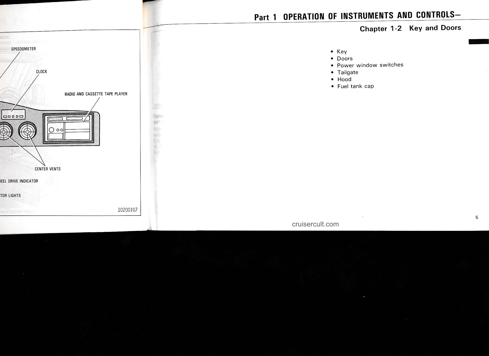

# Page 11

# Part 1 OPERATION OF INSTRUMENTS AND CONTROLS—

## Chapter 1-2  Key and Doors

- Key
- Doors
- Power window switches
- Tailgate
- Hood
- Fuel tank cap

### Diagram labels (left page)
- SPEEDOMETER
- CLOCK
- RADIO AND CASSETTE TAPE PLAYER
- CENTER VENTS
- EEL DRIVE INDICATOR
- TOR LIGHTS
- 10200107

cruisercult.com

5

---

## Original Page Image

