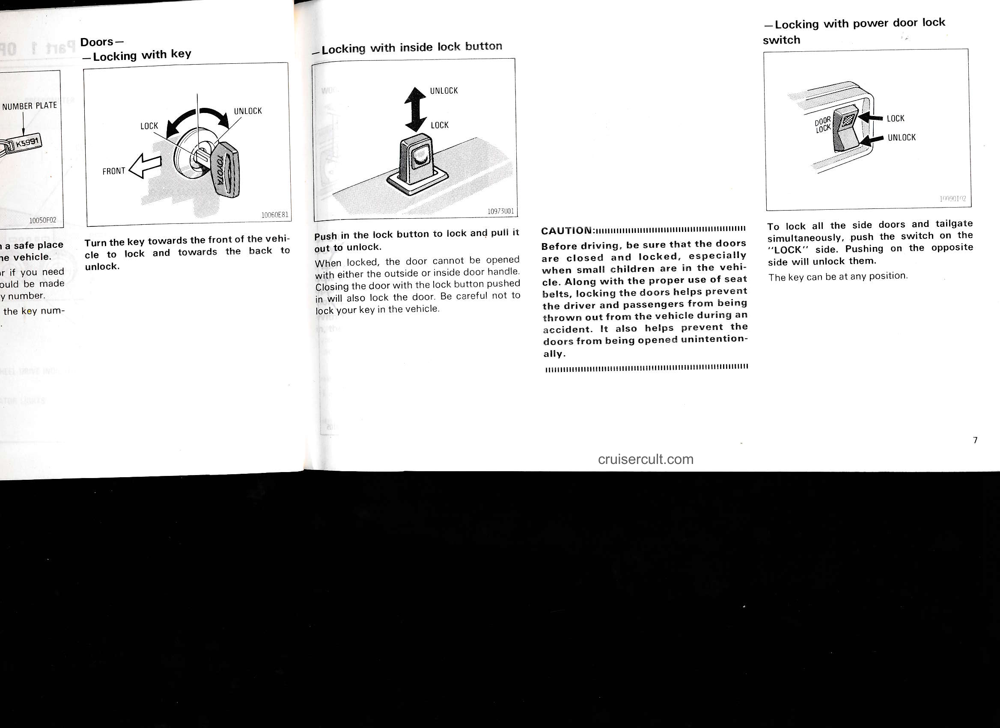

# Page 13

# Doors —

## — Locking with key
![diagram]

LOCK ↔ UNLOCK  
FRONT

Turn the key towards the front of the vehicle to lock and towards the back to unlock.

10050F02 10060E81

---

## — Locking with inside lock button
![diagram]

UNLOCK ↑  
LOCK ↓

Push in the lock button to lock and pull it out to unlock.

When locked, the door cannot be opened with either the outside or inside door handle. Closing the door with the lock button pushed in will also lock the door. Be careful not to lock your key in the vehicle.

10973U01

---

## CAUTION:
Before driving, be sure that the doors are closed and locked, especially when small children are in the vehicle. Along with the proper use of seat belts, locking the doors helps prevent the driver and passengers from being thrown out from the vehicle during an accident. It also helps prevent the doors from being opened unintentionally.

---

## — Locking with power door lock switch
![diagram]

DOOR LOCK  
LOCK →  
UNLOCK ←

To lock all the side doors and tailgate simultaneously, push the switch on the "LOCK" side. Pushing on the opposite side will unlock them.

The key can be at any position.

10090T02

cruisercult.com

7

---

## Original Page Image

