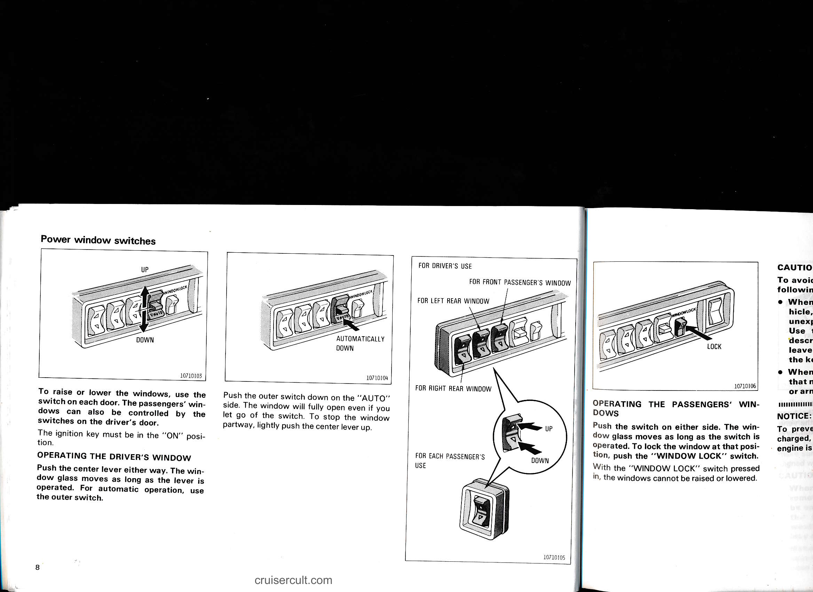

# Page 14

# Power window switches

![diagram]

---

To raise or lower the windows, use the switch on each door. The passengers' windows can also be controlled by the switches on the driver's door.

The ignition key must be in the "ON" position.

## OPERATING THE DRIVER'S WINDOW

Push the center lever either way. The window glass moves as long as the lever is operated. For automatic operation, use the outer switch.

Push the outer switch down on the "AUTO" side. The window will fully open even if you let go of the switch. To stop the window partway, lightly push the center lever up.

---

### Diagram labels
- UP
- DOWN
- AUTOMATICALLY DOWN

- FOR DRIVER'S USE
- FOR FRONT PASSENGER'S WINDOW
- FOR LEFT REAR WINDOW
- FOR RIGHT REAR WINDOW
- FOR EACH PASSENGER'S USE

---

## OPERATING THE PASSENGERS' WINDOWS

Push the switch on either side. The window glass moves as long as the switch is operated. To lock the window at that position, push the "WINDOW LOCK" switch.

With the "WINDOW LOCK" switch pressed in, the windows cannot be raised or lowered.

---

cruisercult.com

---

## Original Page Image

