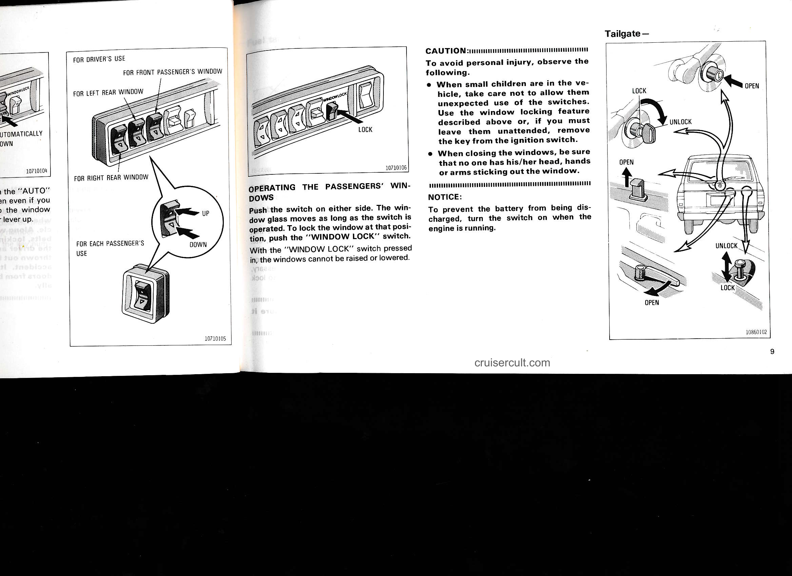

# Page 15

# FOR DRIVER'S USE

- FOR FRONT PASSENGER'S WINDOW
- FOR LEFT REAR WINDOW
- FOR RIGHT REAR WINDOW
- FOR EACH PASSENGER'S USE

(UP / DOWN)

---

# OPERATING THE PASSENGERS' WINDOWS

Push the switch on either side. The window glass moves as long as the switch is operated. To lock the window at that position, push the "WINDOW LOCK" switch.

With the "WINDOW LOCK" switch pressed in, the windows cannot be raised or lowered.

---

# CAUTION:

To avoid personal injury, observe the following.

- When small children are in the vehicle, take care not to allow them unexpected use of the switches. Use the window locking feature described above or, if you must leave them unattended, remove the key from the ignition switch.
- When closing the windows, be sure that no one has his/her head, hands or arms sticking out the window.

---

# NOTICE:

To prevent the battery from being discharged, turn the switch on when the engine is running.

---

# Tailgate —

- LOCK → UNLOCK (illustrated)
- OPEN (illustrated)
- UNLOCK → LOCK (illustrated)

cruisercult.com

9

---

## Original Page Image

