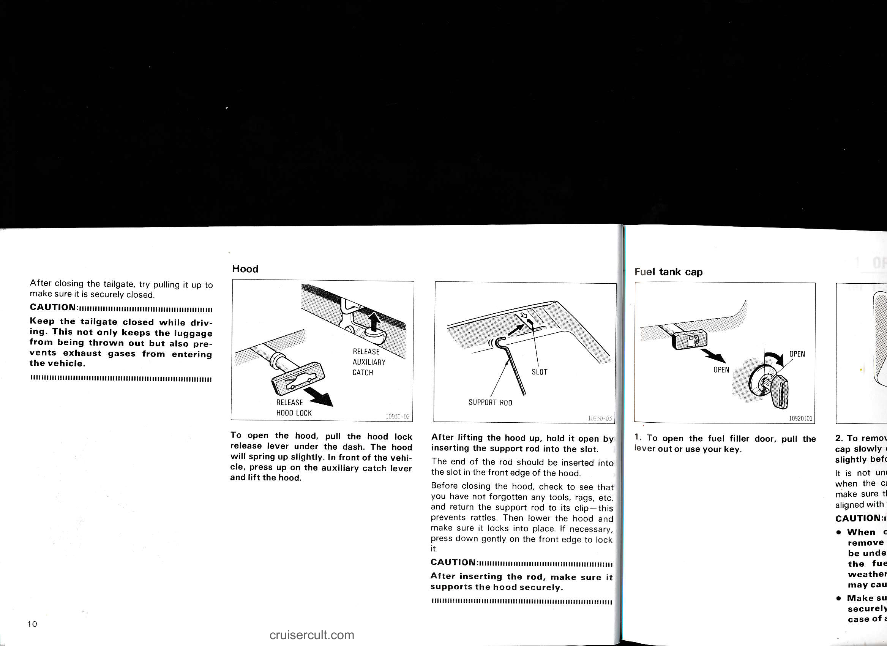

# Page 16

- After closing the tailgate, try pulling it up to make sure it is securely closed.

CAUTION:
Keep the tailgate closed while driving. This not only keeps the luggage from being thrown out but also prevents exhaust gases from entering the vehicle.

---

# Hood

![Release hood lock / auxiliary catch illustration]

To open the hood, pull the hood lock release lever under the dash. The hood will spring up slightly. In front of the vehicle, press up on the auxiliary catch lever and lift the hood.

![Support rod / slot illustration]

After lifting the hood up, hold it open by inserting the support rod into the slot.

The end of the rod should be inserted into the slot in the front edge of the hood.

Before closing the hood, check to see that you have not forgotten any tools, rags, etc. and return the support rod to its clip—this prevents rattles. Then lower the hood and make sure it locks into place. If necessary, press down gently on the front edge to lock it.

CAUTION:
After inserting the rod, make sure it supports the hood securely.

---

# Fuel tank cap

![Fuel tank cap illustration]

1. To open the fuel filler door, pull the lever out or use your key.

OPEN

---

10

cruisercult.com

---

## Original Page Image

