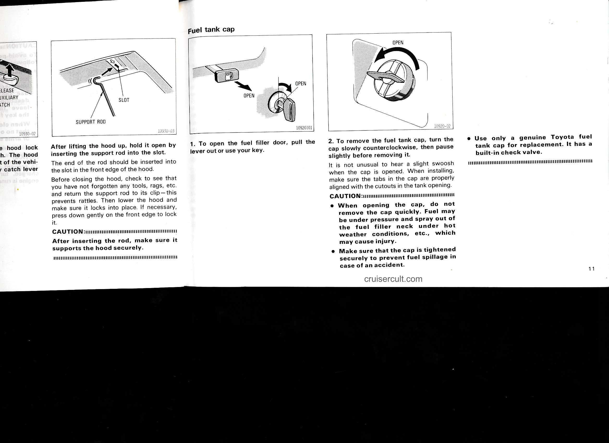

# Page 17

- SUPPORT ROD
- SLOT

After lifting the hood up, hold it open by inserting the support rod into the slot.

The end of the rod should be inserted into the slot in the front edge of the hood.

Before closing the hood, check to see that you have not forgotten any tools, rags, etc. and return the support rod to its clip — this prevents rattles. Then lower the hood and make sure it locks into place. If necessary, press down gently on the front edge to lock it.

CAUTION:
After inserting the rod, make sure it supports the hood securely.

---

Fuel tank cap

1. To open the fuel filler door, pull the lever out or use your key.

2. To remove the fuel tank cap, turn the cap slowly counterclockwise, then pause slightly before removing it.

It is not unusual to hear a slight swoosh when the cap is opened. When installing, make sure the tabs in the cap are properly aligned with the cutouts in the tank opening.

CAUTION:
- When opening the cap, do not remove the cap quickly. Fuel may be under pressure and spray out of the fuel filler neck under hot weather conditions, etc., which may cause injury.
- Make sure that the cap is tightened securely to prevent fuel spillage in case of an accident.

- Use only a genuine Toyota fuel tank cap for replacement. It has a built-in check valve.

cruisercult.com

11

---

## Original Page Image

