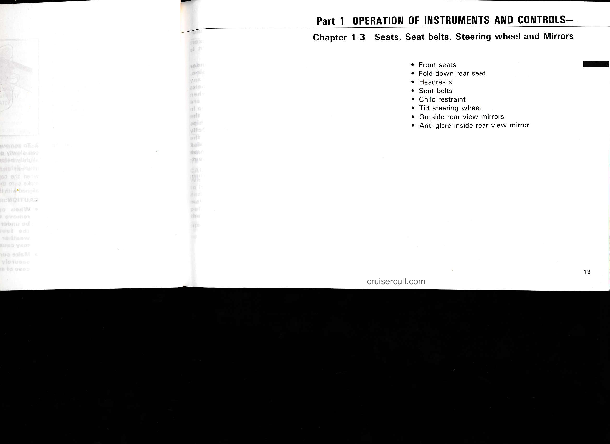

# Page 19

# Part 1  OPERATION OF INSTRUMENTS AND CONTROLS—

## Chapter 1-3  Seats, Seat belts, Steering wheel and Mirrors

- Front seats
- Fold-down rear seat
- Headrests
- Seat belts
- Child restraint
- Tilt steering wheel
- Outside rear view mirrors
- Anti-glare inside rear view mirror

cruisercult.com

13

---

## Original Page Image

