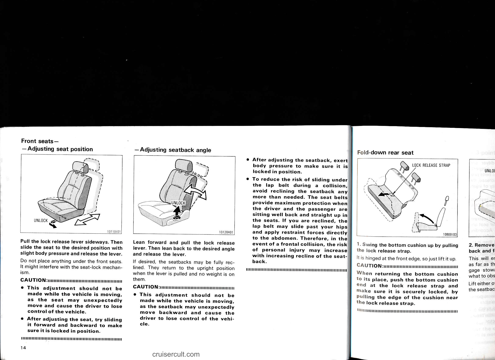

# Page 20

# Front seats —

## — Adjusting seat position

Pull the lock release lever sideways. Then slide the seat to the desired position with slight body pressure and release the lever.

Do not place anything under the front seats.  
It might interfere with the seat-lock mechanism.

**CAUTION:**  
- This adjustment should not be made while the vehicle is moving, as the seat may unexpectedly move and cause the driver to lose control of the vehicle.  
- After adjusting the seat, try sliding it forward and backward to make sure it is locked in position.

---

## — Adjusting seatback angle

Lean forward and pull the lock release lever. Then lean back to the desired angle and release the lever.

If desired, the seatbacks may be fully reclined. They return to the upright position when the lever is pulled and no weight is on them.

**CAUTION:**  
- This adjustment should not be made while the vehicle is moving, as the seatback may unexpectedly move backward and cause the driver to lose control of the vehicle.

- After adjusting the seatback, exert body pressure to make sure it is locked in position.  
- To reduce the risk of sliding under the lap belt during a collision, avoid reclining the seatback any more than needed. The seat belts provide maximum protection when the driver and the passenger are sitting well back and straight up in the seats. If you are reclined, the lap belt may slide past your hips and apply restraint forces directly to the abdomen. Therefore, in the event of a frontal collision, the risk of personal injury may increase with increasing recline of the seatback.

---

# Fold-down rear seat

LOCK RELEASE STRAP

1. Swing the bottom cushion up by pulling the lock release strap.

It is hinged at the front edge, so just lift it up.

**CAUTION:**  
When returning the bottom cushion to its place, push the bottom cushion end at the lock release strap and make sure it is securely locked, by pulling the edge of the cushion near the lock release strap.

2. Remove the back and f...

---

## Original Page Image

