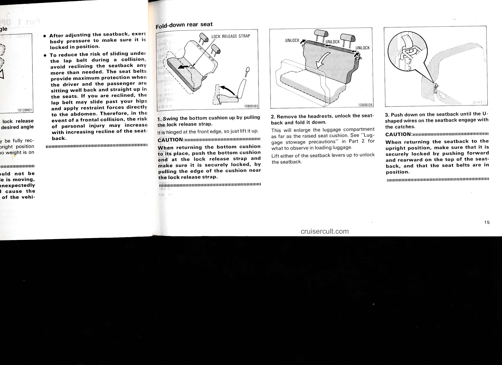

# Page 21

# Fold-down rear seat

- After adjusting the seatback, exert body pressure to make sure it is locked in position.
- To reduce the risk of sliding under the lap belt during a collision, avoid reclining the seatback any more than needed. The seat belts provide maximum protection when the driver and the passenger are sitting well back and straight up in the seats. If you are reclined, the lap belt may slide past your hips and apply restraint forces directly to the abdomen. Therefore, in the event of a frontal collision, the risk of personal injury may increase with increasing recline of the seatback.

---

LOCK RELEASE STRAP

1. Swing the bottom cushion up by pulling the lock release strap.  
   It is hinged at the front edge, so just lift it up.

   **CAUTION:**  
   When returning the bottom cushion to its place, push the bottom cushion end at the lock release strap and make sure it is securely locked, by pulling the edge of the cushion near the lock release strap.

---

2. Remove the headrests, unlock the seatback and fold it down.  
   This will enlarge the luggage compartment as far as the raised seat cushion. See "Luggage stowage precautions" in Part 2 for what to observe in loading luggage.

   Lift either of the seatback levers up to unlock the seatback.

---

3. Push down on the seatback until the U-shaped wires on the seatback engage with the catches.

   **CAUTION:**  
   When returning the seatback to the upright position, make sure that it is securely locked by pushing forward and rearward on the top of the seatback, and that the seat belts are in position.

---

cruisercult.com

15

---

## Original Page Image

