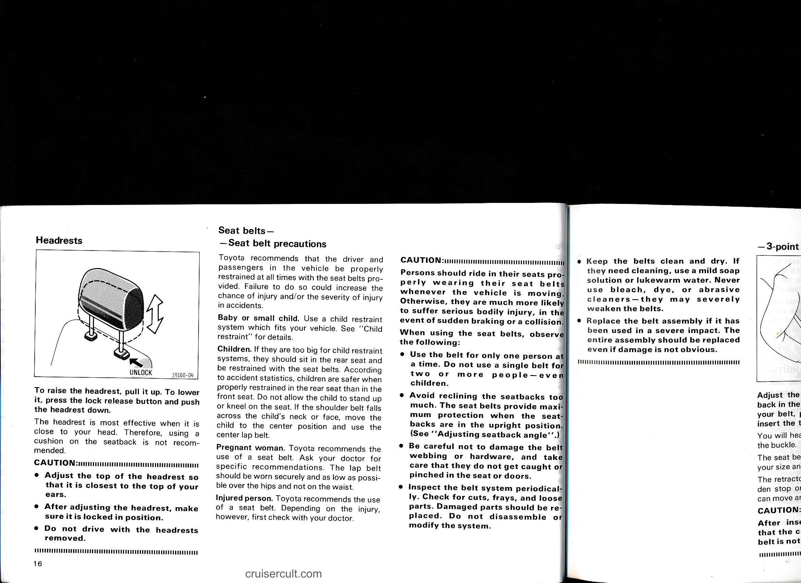

# Page 22

## Headrests

To raise the headrest, pull it up. To lower it, press the lock release button and push the headrest down.

The headrest is most effective when it is close to your head. Therefore, using a cushion on the seatback is not recommended.

CAUTION:
- Adjust the top of the headrest so that it is closest to the top of your ears.
- After adjusting the headrest, make sure it is locked in position.
- Do not drive with the headrests removed.

---

## Seat belts —  
### Seat belt precautions

Toyota recommends that the driver and passengers in the vehicle be properly restrained at all times with the seat belts provided. Failure to do so could increase the chance of injury and/or the severity of injury in accidents.

Baby or small child. Use a child restraint system which fits your vehicle. See "Child restraint" for details.

Children. If they are too big for child restraint systems, they should sit in the rear seat and be restrained with the seat belts. According to accident statistics, children are safer when properly restrained in the rear seat than in the front seat. Do not allow the child to stand up or kneel on the seat. If the shoulder belt falls across the child's neck or face, move the child to the center position and use the center lap belt.

Pregnant woman. Toyota recommends the use of a seat belt. Ask your doctor for specific recommendations. The lap belt should be worn securely and as low as possible over the hips and not on the waist.

Injured person. Toyota recommends the use of a seat belt. Depending on the injury, however, first check with your doctor.

CAUTION:
Persons should ride in their seats properly wearing their seat belts whenever the vehicle is moving. Otherwise, they are much more likely to suffer serious bodily injury in the event of sudden braking or a collision.

When using the seat belts, observe the following:
- Use the belt for only one person at a time. Do not use a single belt for two or more people—even children.
- Avoid reclining the seatbacks too much. The seat belts provide maximum protection when the seatbacks are in the upright position. (See "Adjusting seatback angle".)
- Be careful not to damage the belt webbing or hardware, and take care that they do not get caught or pinched in the seat or doors.
- Inspect the belt system periodically. Check for cuts, frays, and loose parts. Damaged parts should be replaced. Do not disassemble or modify the system.
- Keep the belts clean and dry. If they need cleaning, use a mild soap solution or lukewarm water. Never use bleach, dye, or abrasive cleaners—they may severely weaken the belts.
- Replace the belt assembly if it has been used in a severe impact. The entire assembly should be replaced even if damage is not obvious.

cruisercult.com

---

## Original Page Image

