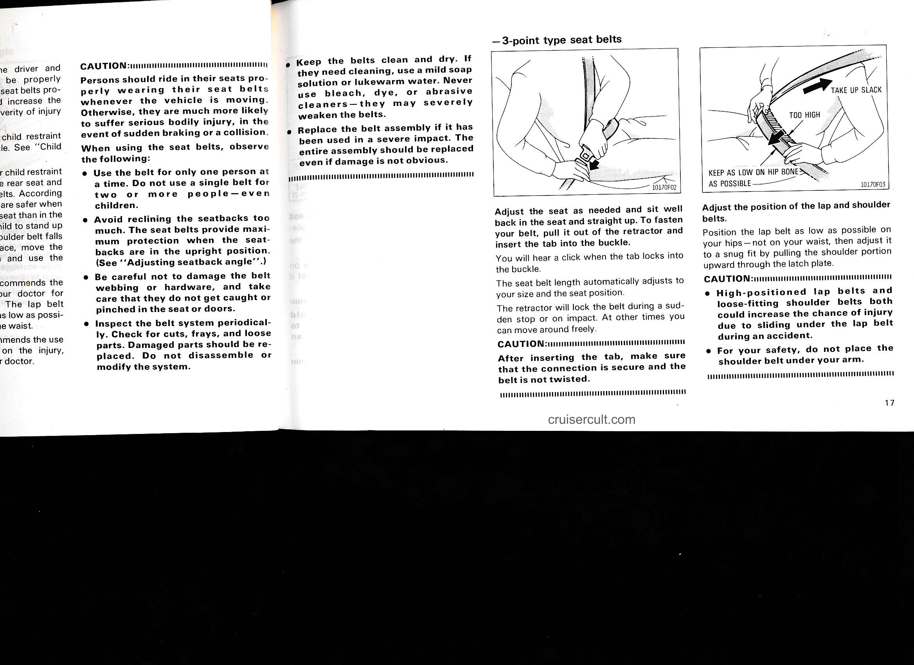

# Page 23

CAUTION:
Persons should ride in their seats properly wearing their seat belts whenever the vehicle is moving. Otherwise, they are much more likely to suffer serious bodily injury, in the event of sudden braking or a collision.
When using the seat belts, observe the following:

- Use the belt for only one person at a time. Do not use a single belt for two or more people — even children.

- Avoid reclining the seatbacks too much. The seat belts provide maximum protection when the seatbacks are in the upright position. (See "Adjusting seatback angle".)

- Be careful not to damage the belt webbing or hardware, and take care that they do not get caught or pinched in the seat or doors.

- Inspect the belt system periodically. Check for cuts, frays, and loose parts. Damaged parts should be replaced. Do not disassemble or modify the system.

- Keep the belts clean and dry. If they need cleaning, use a mild soap solution or lukewarm water. Never use bleach, dye, or abrasive cleaners — they may severely weaken the belts.

- Replace the belt assembly if it has been used in a severe impact. The entire assembly should be replaced even if damage is not obvious.

- 3-point type seat belts

Adjust the seat as needed and sit well back in the seat and straight up. To fasten your belt, pull it out of the retractor and insert the tab into the buckle.

You will hear a click when the tab locks into the buckle.

The seat belt length automatically adjusts to your size and the seat position.

The retractor will lock the belt during a sudden stop or on impact. At other times you can move around freely.

CAUTION:
After inserting the tab, make sure that the connection is secure and the belt is not twisted.

[Image labels]
- 10170F02

[Image labels]
- TAKE UP SLACK
- TOO HIGH
- KEEP AS LOW ON HIP BONE AS POSSIBLE
- 10170F03

Adjust the position of the lap and shoulder belts.

Position the lap belt as low as possible on your hips — not on your waist, then adjust it to a snug fit by pulling the shoulder portion upward through the latch plate.

CAUTION:
- High-positioned lap belts and loose-fitting shoulder belts both could increase the chance of injury due to sliding under the lap belt during an accident.

- For your safety, do not place the shoulder belt under your arm.

cruisercult.com

17

---

## Original Page Image

