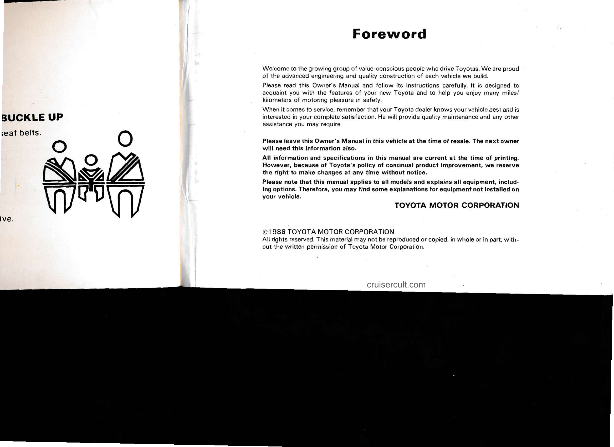

# Page 3

# BUCKLE UP

seat belts.

# Foreword

Welcome to the growing group of value-conscious people who drive Toyotas. We are proud of the advanced engineering and quality construction of each vehicle we build.

Please read this Owner's Manual and follow its instructions carefully. It is designed to acquaint you with the features of your new Toyota and to help you enjoy many miles/ kilometers of motoring pleasure in safety.

When it comes to service, remember that your Toyota dealer knows your vehicle best and is interested in your complete satisfaction. He will provide quality maintenance and any other assistance you may require.

Please leave this Owner's Manual in this vehicle at the time of resale. The next owner will need this information also.

All information and specifications in this manual are current at the time of printing. However, because of Toyota's policy of continual product improvement, we reserve the right to make changes at any time without notice.

Please note that this manual applies to all models and explains all equipment, including options. Therefore, you may find some explanations for equipment not installed on your vehicle.

TOYOTA MOTOR CORPORATION

©1988 TOYOTA MOTOR CORPORATION  
All rights reserved. This material may not be reproduced or copied, in whole or in part, without the written permission of Toyota Motor Corporation.

cruisercult.com

---

## Original Page Image

