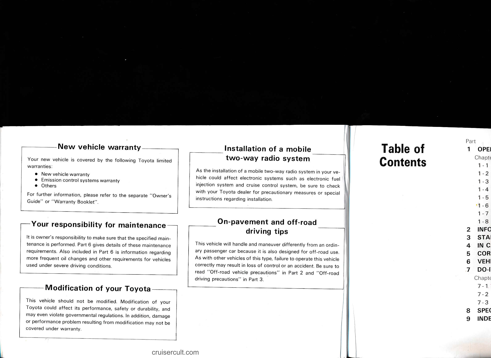

# Page 4

## New vehicle warranty

Your new vehicle is covered by the following Toyota limited warranties:
- New vehicle warranty
- Emission control systems warranty
- Others

For further information, please refer to the separate "Owner's Guide" or "Warranty Booklet".

---

## Installation of a mobile two-way radio system

As the installation of a mobile two-way radio system in your vehicle could affect electronic systems such as electronic fuel injection system and cruise control system, be sure to check with your Toyota dealer for precautionary measures or special instructions regarding installation.

---

## Your responsibility for maintenance

It is owner's responsibility to make sure that the specified maintenance is performed. Part 6 gives details of these maintenance requirements. Also included in Part 6 is information regarding more frequent oil changes and other requirements for vehicles used under severe driving conditions.

---

## On-pavement and off-road driving tips

This vehicle will handle and maneuver differently from an ordinary passenger car because it is also designed for off-road use. As with other vehicles of this type, failure to operate this vehicle correctly may result in loss of control or an accident. Be sure to read "Off-road vehicle precautions" in Part 2 and "Off-road driving precautions" in Part 3.

---

## Modification of your Toyota

This vehicle should not be modified. Modification of your Toyota could affect its performance, safety or durability, and may even violate governmental regulations. In addition, damage or performance problem resulting from modification may not be covered under warranty.

---

cruisercult.com

---

# Table of Contents

Part

1  OPE
Chapter
1-1
1-2
1-3
1-4
1-5
1-6
1-7
1-8

2  INFO
3  STA
4  IN C
5  COR
6  VEH
7  DO-I
Chapter
7-1
7-2
7-3

8  SPEC
9  INDE

---

## Original Page Image

