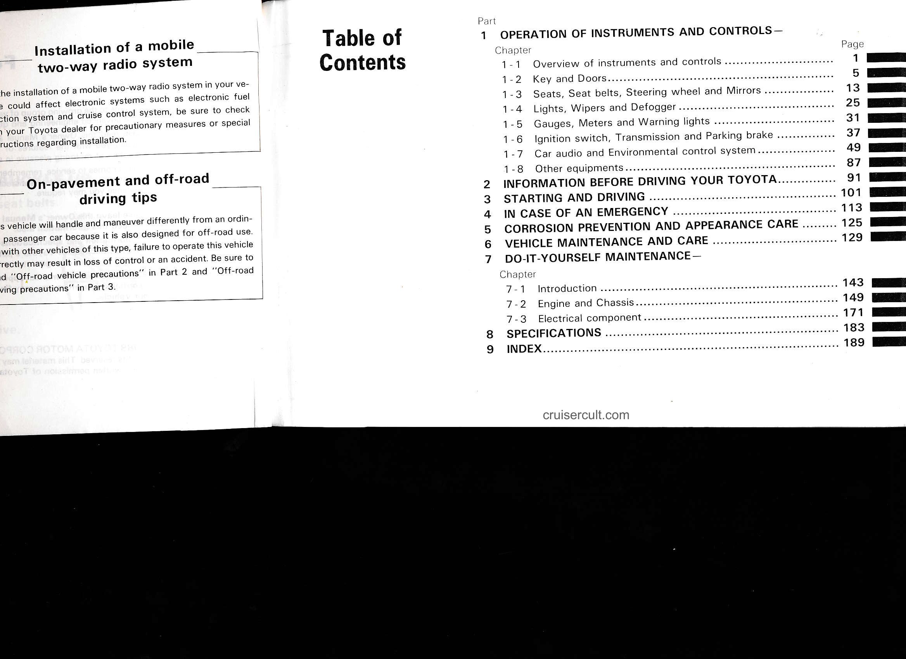

# Page 5

## Installation of a mobile two-way radio system

The installation of a mobile two-way radio system in your ve-
hicle could affect electronic systems such as electronic fuel
injection system and cruise control system, be sure to check
with your Toyota dealer for precautionary measures or special
instructions regarding installation.

## On-pavement and off-road driving tips

This vehicle will handle and maneuver differently from an ordin-
ary passenger car because it is also designed for off-road use.
As with other vehicles of this type, failure to operate this vehicle
correctly may result in loss of control or an accident. Be sure to
see "Off-road vehicle precautions" in Part 2 and "Off-road
driving precautions" in Part 3.

# Table of Contents

Part 1 - OPERATION OF INSTRUMENTS AND CONTROLS
- Chapter
  - 1-1 Overview of instruments and controls ..................................... 1
  - 1-2 Key and Doors ............................................................ 5
  - 1-3 Seats, Seat belts, Steering wheel and Mirrors ..................... 13
  - 1-4 Lights, Wipers and Defogger .......................................... 25
  - 1-5 Gauges, Meters and Warning lights ................................ 31
  - 1-6 Ignition switch, Transmission and Parking brake ............... 37
  - 1-7 Car audio and Environmental control system ...................... 49
  - 1-8 Other equipments ....................................................... 87

2 - INFORMATION BEFORE DRIVING YOUR TOYOTA .............................. 91

3 - STARTING AND DRIVING ........................................................ 101

4 - IN CASE OF AN EMERGENCY .................................................... 113

5 - CORROSION PREVENTION AND APPEARANCE CARE ................. 125

6 - VEHICLE MAINTENANCE AND CARE ....................................... 129

7 - DO-IT-YOURSELF MAINTENANCE
- Chapter
  - 7-1 Introduction .......................................................... 143
  - 7-2 Engine and Chassis ................................................ 149
  - 7-3 Electrical component .............................................. 171

8 - SPECIFICATIONS .............................................................. 183

9 - INDEX ........................................................................ 189

cruisercult.com

---

## Original Page Image

