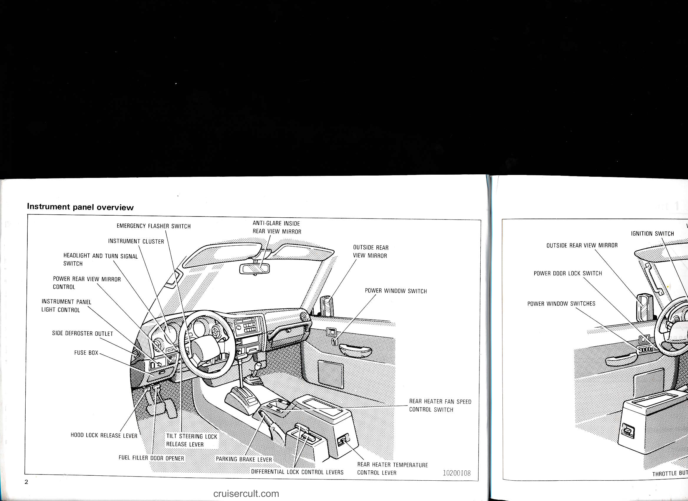

# Page 8

# Instrument panel overview

- EMERGENCY FLASHER SWITCH
- INSTRUMENT CLUSTER
- HEADLIGHT AND TURN SIGNAL SWITCH
- POWER REAR VIEW MIRROR CONTROL
- INSTRUMENT PANEL LIGHT CONTROL
- SIDE DEFROSTER OUTLET
- FUSE BOX
- HOOD LOCK RELEASE LEVER
- FUEL FILLER DOOR OPENER
- TILT STEERING LOCK RELEASE LEVER
- PARKING BRAKE LEVER
- DIFFERENTIAL LOCK CONTROL LEVERS
- ANTI-GLARE INSIDE REAR VIEW MIRROR
- OUTSIDE REAR VIEW MIRROR
- POWER WINDOW SWITCH
- REAR HEATER FAN SPEED CONTROL SWITCH
- REAR HEATER TEMPERATURE CONTROL LEVER
- 10200108
- cruisercult.com

- IGNITION SWITCH
- OUTSIDE REAR VIEW MIRROR
- POWER DOOR LOCK SWITCH
- POWER WINDOW SWITCHES
- THROTTLE BUT

---

## Original Page Image

