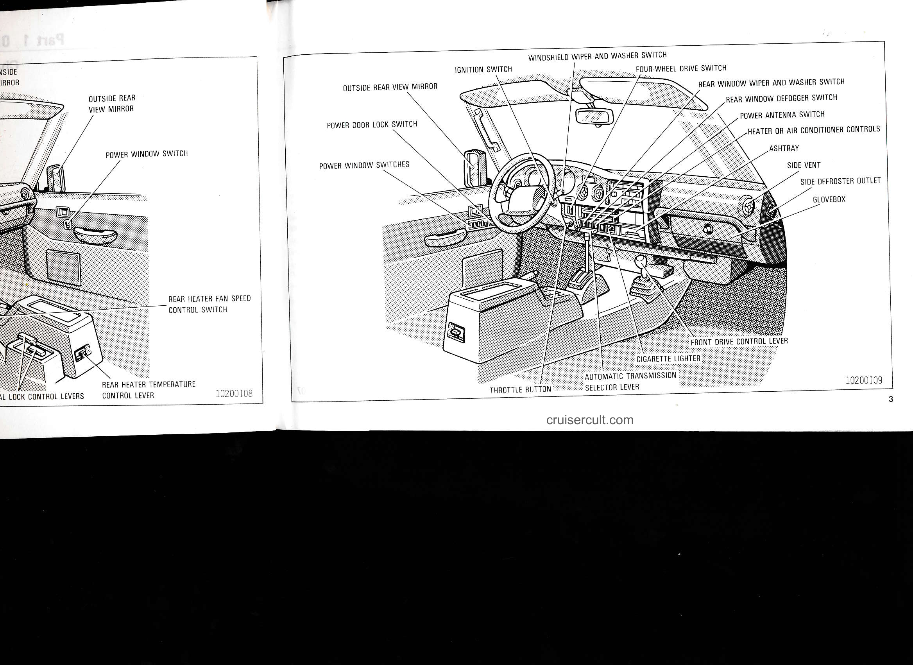
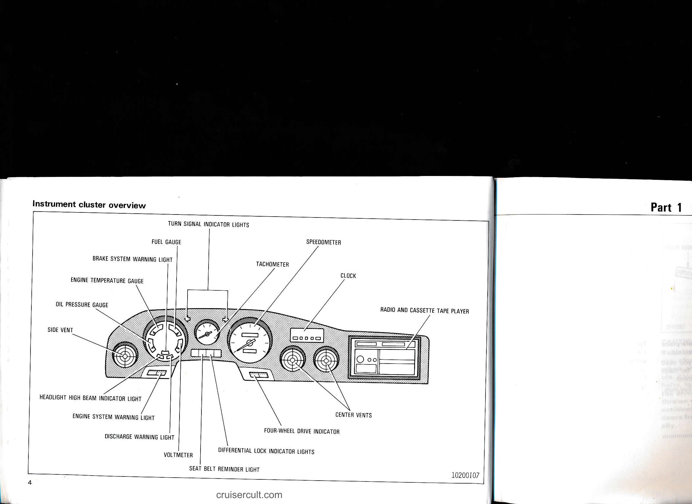

# 1-1. Overview of Instruments and Controls

## Page 1

# Part 1 OPERATION OF INSTRUMENTS AND CONTROLS—

## Chapter 1-1  Overview of instruments and controls

- Instrument panel overview
- Instrument cluster overview

cruisercult.com

1

---

## Page 2

# Instrument panel overview

- EMERGENCY FLASHER SWITCH
- INSTRUMENT CLUSTER
- HEADLIGHT AND TURN SIGNAL SWITCH
- POWER REAR VIEW MIRROR CONTROL
- INSTRUMENT PANEL LIGHT CONTROL
- SIDE DEFROSTER OUTLET
- FUSE BOX
- HOOD LOCK RELEASE LEVER
- FUEL FILLER DOOR OPENER
- TILT STEERING LOCK RELEASE LEVER
- PARKING BRAKE LEVER
- DIFFERENTIAL LOCK CONTROL LEVERS
- ANTI-GLARE INSIDE REAR VIEW MIRROR
- OUTSIDE REAR VIEW MIRROR
- POWER WINDOW SWITCH
- REAR HEATER FAN SPEED CONTROL SWITCH
- REAR HEATER TEMPERATURE CONTROL LEVER
- 10200108
- cruisercult.com

- IGNITION SWITCH
- OUTSIDE REAR VIEW MIRROR
- POWER DOOR LOCK SWITCH
- POWER WINDOW SWITCHES
- THROTTLE BUT

---

## Page 3

# Left Page
- OUTSIDE REAR VIEW MIRROR
- POWER WINDOW SWITCH
- REAR HEATER FAN SPEED CONTROL SWITCH
- DOOR LOCK CONTROL LEVERS
- REAR HEATER TEMPERATURE CONTROL LEVER
- 10200108

# Right Page
- WINDSHIELD WIPER AND WASHER SWITCH
- IGNITION SWITCH
- OUTSIDE REAR VIEW MIRROR
- POWER DOOR LOCK SWITCH
- POWER WINDOW SWITCHES
- FOUR-WHEEL DRIVE SWITCH
- REAR WINDOW WIPER AND WASHER SWITCH
- REAR WINDOW DEFOGGER SWITCH
- POWER ANTENNA SWITCH
- HEATER OR AIR CONDITIONER CONTROLS
- ASHTRAY
- SIDE VENT
- SIDE DEFROSTER OUTLET
- GLOVEBOX
- FRONT DRIVE CONTROL LEVER
- CIGARETTE LIGHTER
- AUTOMATIC TRANSMISSION SELECTOR LEVER
- THROTTLE BUTTON
- 10200109
- cruisercult.com
- 3

---

## Page 4

# Instrument cluster overview

- TURN SIGNAL INDICATOR LIGHTS
- FUEL GAUGE
- BRAKE SYSTEM WARNING LIGHT
- ENGINE TEMPERATURE GAUGE
- OIL PRESSURE GAUGE
- SIDE VENT
- HEADLIGHT HIGH BEAM INDICATOR LIGHT
- ENGINE SYSTEM WARNING LIGHT
- DISCHARGE WARNING LIGHT
- VOLTMETER
- SEAT BELT REMINDER LIGHT
- DIFFERENTIAL LOCK INDICATOR LIGHTS
- FOUR-WHEEL DRIVE INDICATOR
- TACHOMETER
- SPEEDOMETER
- CLOCK
- CENTER VENTS
- RADIO AND CASSETTE TAPE PLAYER

10200107

cruisercult.com

Part 1

4

---

