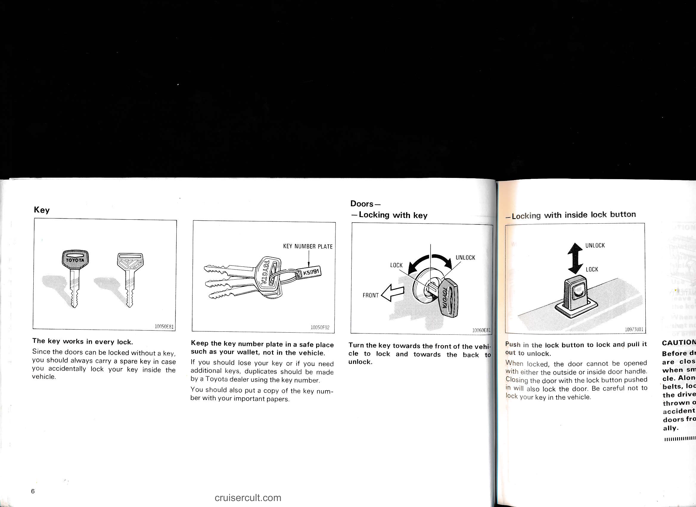

# 1-2. Key and Doors

## Page 5

# Part 1 OPERATION OF INSTRUMENTS AND CONTROLS—

## Chapter 1-2  Key and Doors

- Key
- Doors
- Power window switches
- Tailgate
- Hood
- Fuel tank cap

### Diagram labels (left page)
- SPEEDOMETER
- CLOCK
- RADIO AND CASSETTE TAPE PLAYER
- CENTER VENTS
- EEL DRIVE INDICATOR
- TOR LIGHTS
- 10200107

cruisercult.com

5

---

## Page 6

# Key

10050E81

The key works in every lock.  
Since the doors can be locked without a key, you should always carry a spare key in case you accidentally lock your key inside the vehicle.

KEY NUMBER PLATE

10050F02

Keep the key number plate in a safe place such as your wallet, not in the vehicle.  
If you should lose your key or if you need additional keys, duplicates should be made by a Toyota dealer using the key number.  

You should also put a copy of the key number with your important papers.

cruisercult.com

---

# Doors —

## — Locking with key

10060E81

Turn the key towards the front of the vehicle to lock and towards the back to unlock.

## — Locking with inside lock button

10973U01

Push in the lock button to lock and pull it out to unlock.  
When locked, the door cannot be opened with either the outside or inside door handle. Closing the door with the lock button pushed in will also lock the door. Be careful not to lock your key in the vehicle.

---

## Page 7

# Doors —

## — Locking with key
![diagram]

LOCK ↔ UNLOCK  
FRONT

Turn the key towards the front of the vehicle to lock and towards the back to unlock.

10050F02 10060E81

---

## — Locking with inside lock button
![diagram]

UNLOCK ↑  
LOCK ↓

Push in the lock button to lock and pull it out to unlock.

When locked, the door cannot be opened with either the outside or inside door handle. Closing the door with the lock button pushed in will also lock the door. Be careful not to lock your key in the vehicle.

10973U01

---

## CAUTION:
Before driving, be sure that the doors are closed and locked, especially when small children are in the vehicle. Along with the proper use of seat belts, locking the doors helps prevent the driver and passengers from being thrown out from the vehicle during an accident. It also helps prevent the doors from being opened unintentionally.

---

## — Locking with power door lock switch
![diagram]

DOOR LOCK  
LOCK →  
UNLOCK ←

To lock all the side doors and tailgate simultaneously, push the switch on the "LOCK" side. Pushing on the opposite side will unlock them.

The key can be at any position.

10090T02

cruisercult.com

7

---

## Page 8

# Power window switches

![diagram]

---

To raise or lower the windows, use the switch on each door. The passengers' windows can also be controlled by the switches on the driver's door.

The ignition key must be in the "ON" position.

## OPERATING THE DRIVER'S WINDOW

Push the center lever either way. The window glass moves as long as the lever is operated. For automatic operation, use the outer switch.

Push the outer switch down on the "AUTO" side. The window will fully open even if you let go of the switch. To stop the window partway, lightly push the center lever up.

---

### Diagram labels
- UP
- DOWN
- AUTOMATICALLY DOWN

- FOR DRIVER'S USE
- FOR FRONT PASSENGER'S WINDOW
- FOR LEFT REAR WINDOW
- FOR RIGHT REAR WINDOW
- FOR EACH PASSENGER'S USE

---

## OPERATING THE PASSENGERS' WINDOWS

Push the switch on either side. The window glass moves as long as the switch is operated. To lock the window at that position, push the "WINDOW LOCK" switch.

With the "WINDOW LOCK" switch pressed in, the windows cannot be raised or lowered.

---

cruisercult.com

---

## Page 9

# FOR DRIVER'S USE

- FOR FRONT PASSENGER'S WINDOW
- FOR LEFT REAR WINDOW
- FOR RIGHT REAR WINDOW
- FOR EACH PASSENGER'S USE

(UP / DOWN)

---

# OPERATING THE PASSENGERS' WINDOWS

Push the switch on either side. The window glass moves as long as the switch is operated. To lock the window at that position, push the "WINDOW LOCK" switch.

With the "WINDOW LOCK" switch pressed in, the windows cannot be raised or lowered.

---

# CAUTION:

To avoid personal injury, observe the following.

- When small children are in the vehicle, take care not to allow them unexpected use of the switches. Use the window locking feature described above or, if you must leave them unattended, remove the key from the ignition switch.
- When closing the windows, be sure that no one has his/her head, hands or arms sticking out the window.

---

# NOTICE:

To prevent the battery from being discharged, turn the switch on when the engine is running.

---

# Tailgate —

- LOCK → UNLOCK (illustrated)
- OPEN (illustrated)
- UNLOCK → LOCK (illustrated)

cruisercult.com

9

---

## Page 10

- After closing the tailgate, try pulling it up to make sure it is securely closed.

CAUTION:
Keep the tailgate closed while driving. This not only keeps the luggage from being thrown out but also prevents exhaust gases from entering the vehicle.

---

# Hood

![Release hood lock / auxiliary catch illustration]

To open the hood, pull the hood lock release lever under the dash. The hood will spring up slightly. In front of the vehicle, press up on the auxiliary catch lever and lift the hood.

![Support rod / slot illustration]

After lifting the hood up, hold it open by inserting the support rod into the slot.

The end of the rod should be inserted into the slot in the front edge of the hood.

Before closing the hood, check to see that you have not forgotten any tools, rags, etc. and return the support rod to its clip—this prevents rattles. Then lower the hood and make sure it locks into place. If necessary, press down gently on the front edge to lock it.

CAUTION:
After inserting the rod, make sure it supports the hood securely.

---

# Fuel tank cap

![Fuel tank cap illustration]

1. To open the fuel filler door, pull the lever out or use your key.

OPEN

---

10

cruisercult.com

---

## Page 11

- SUPPORT ROD
- SLOT

After lifting the hood up, hold it open by inserting the support rod into the slot.

The end of the rod should be inserted into the slot in the front edge of the hood.

Before closing the hood, check to see that you have not forgotten any tools, rags, etc. and return the support rod to its clip — this prevents rattles. Then lower the hood and make sure it locks into place. If necessary, press down gently on the front edge to lock it.

CAUTION:
After inserting the rod, make sure it supports the hood securely.

---

Fuel tank cap

1. To open the fuel filler door, pull the lever out or use your key.

2. To remove the fuel tank cap, turn the cap slowly counterclockwise, then pause slightly before removing it.

It is not unusual to hear a slight swoosh when the cap is opened. When installing, make sure the tabs in the cap are properly aligned with the cutouts in the tank opening.

CAUTION:
- When opening the cap, do not remove the cap quickly. Fuel may be under pressure and spray out of the fuel filler neck under hot weather conditions, etc., which may cause injury.
- Make sure that the cap is tightened securely to prevent fuel spillage in case of an accident.

- Use only a genuine Toyota fuel tank cap for replacement. It has a built-in check valve.

cruisercult.com

11

---

## Page 12

# Part 1 OF

Chapter 1-3

12

cruisercult.com

---

