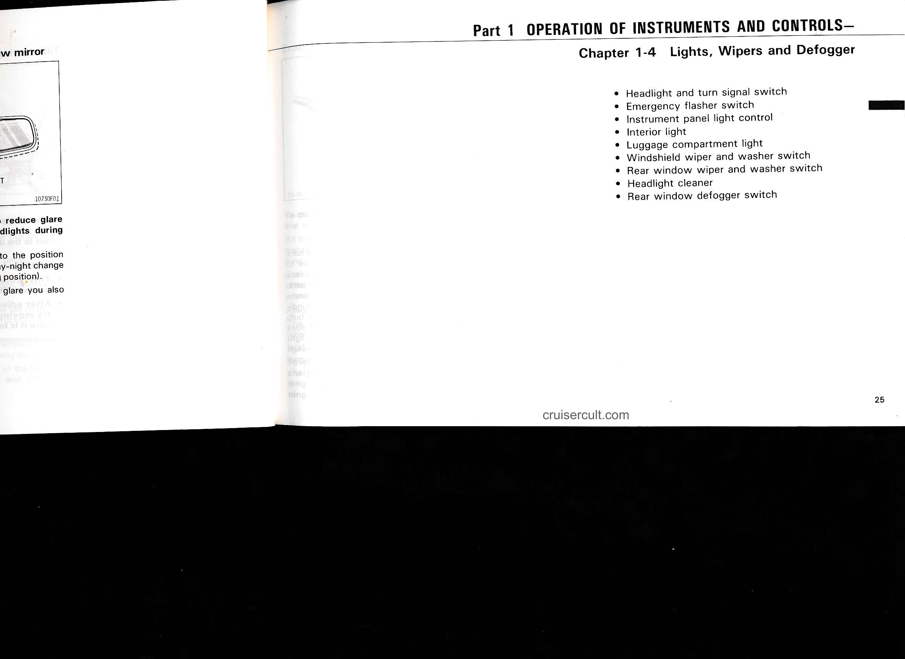
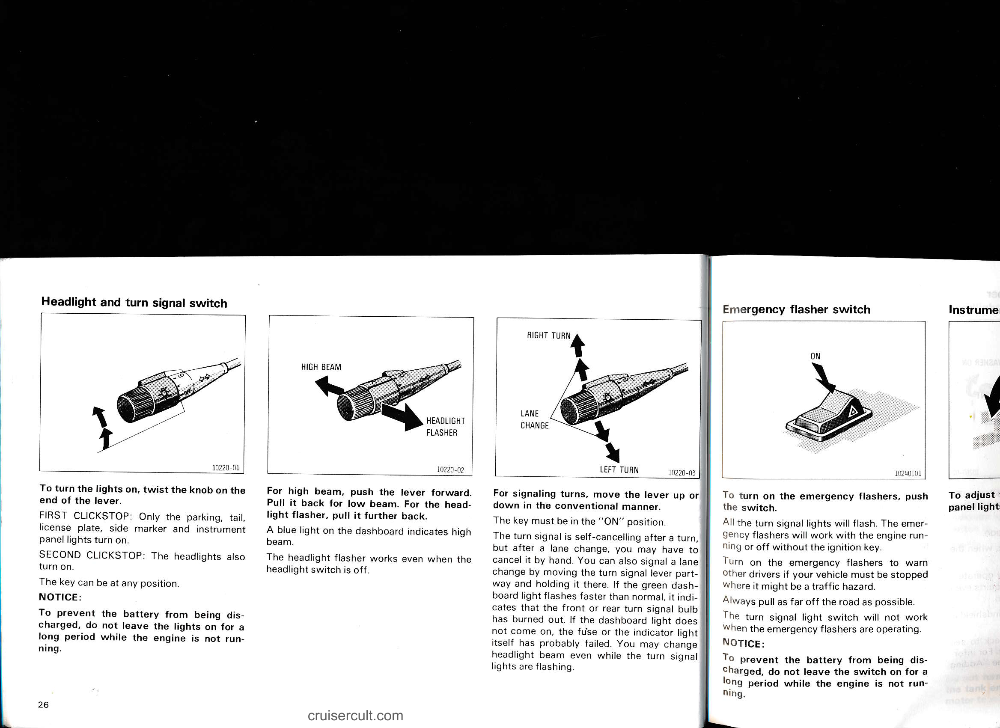
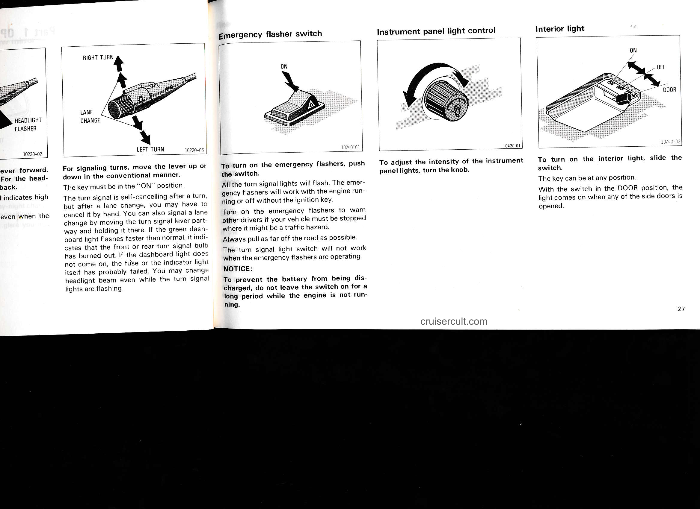
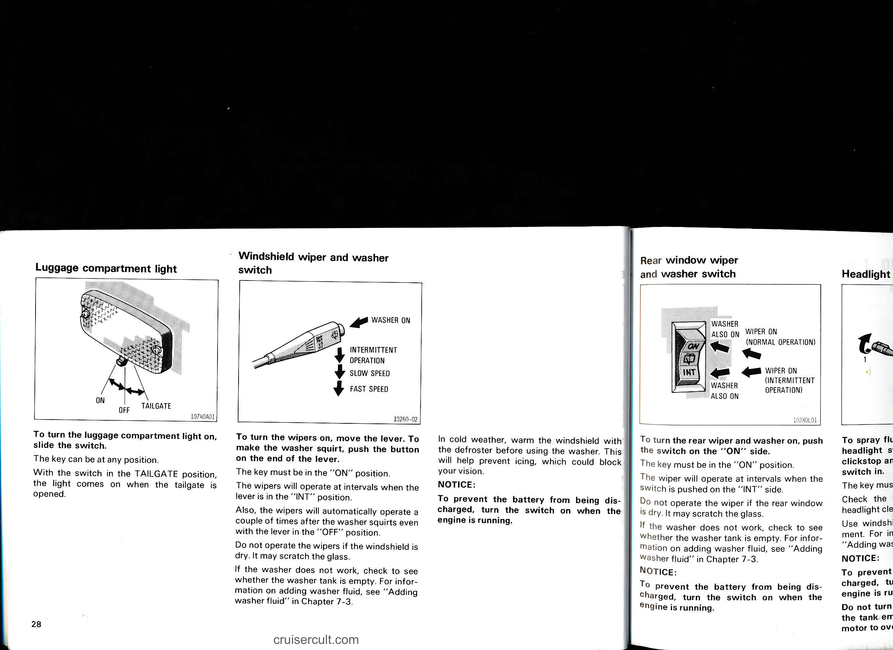
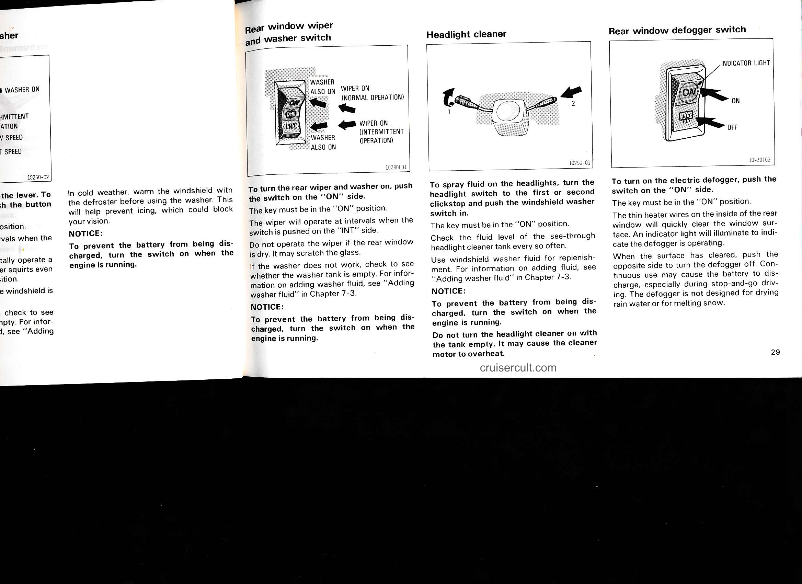
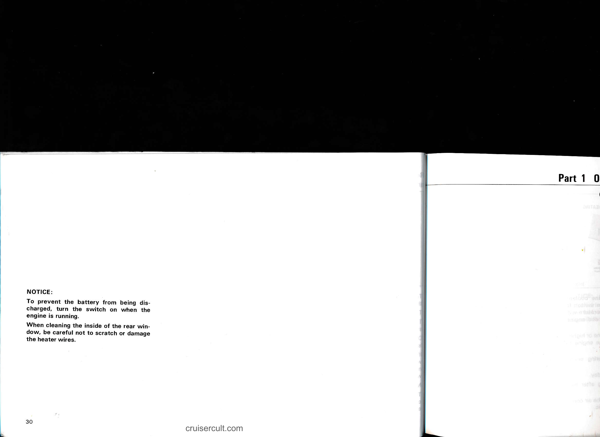

# 1-4. Lights, Wipers and Defogger

## Page 25

# Part 1 OPERATION OF INSTRUMENTS AND CONTROLS—

## Chapter 1-4  Lights, Wipers and Defogger

- Headlight and turn signal switch
- Emergency flasher switch
- Instrument panel light control
- Interior light
- Luggage compartment light
- Windshield wiper and washer switch
- Rear window wiper and washer switch
- Headlight cleaner
- Rear window defogger switch

cruisercult.com

25

---

## Page 26

# Headlight and turn signal switch

![10220-01]

To turn the lights on, twist the knob on the end of the lever.

FIRST CLICKSTOP: Only the parking, tail, license plate, side marker and instrument panel lights turn on.

SECOND CLICKSTOP: The headlights also turn on.

The key can be at any position.

NOTICE:  
To prevent the battery from being discharged, do not leave the lights on for a long period while the engine is not running.

---

![10220-02]  
**HIGH BEAM** →  
**HEADLIGHT FLASHER** →

For high beam, push the lever forward. Pull it back for low beam. For the headlight flasher, pull it further back.

A blue light on the dashboard indicates high beam.

The headlight flasher works even when the headlight switch is off.

---

![10220-03]  
**RIGHT TURN** ↑  
**LANE CHANGE** ↗  
**LEFT TURN** ↓

For signaling turns, move the lever up or down in the conventional manner.

The key must be in the "ON" position.

The turn signal is self-cancelling after a turn, but after a lane change, you may have to cancel it by hand. You can also signal a lane change by moving the turn signal lever part-way and holding it there. If the green dashboard light flashes faster than normal, it indicates that the front or rear turn signal bulb has burned out. If the dashboard light does not come on, the fuse or the indicator light itself has probably failed. You may change headlight beam even while the turn signal lights are flashing.

---

Page 26

# Emergency flasher switch

![10240101]

To turn on the emergency flashers, push the switch.

All the turn signal lights will flash. The emergency flashers will work with the engine running or off without the ignition key.

Turn on the emergency flashers to warn other drivers if your vehicle must be stopped where it might be a traffic hazard.

Always pull as far off the road as possible.

The turn signal light switch will not work when the emergency flashers are operating.

NOTICE:  
To prevent the battery from being discharged, do not leave the switch on for a long period while the engine is not running.

---

## Page 27

# For signaling turns, move the lever up or down in the conventional manner.

The key must be in the "ON" position.

The turn signal is self-cancelling after a turn, but after a lane change, you may have to cancel it by hand. You can also signal a lane change by moving the turn signal lever partway and holding it there. If the green dashboard light flashes faster than normal, it indicates that the front or rear turn signal bulb has burned out. If the dashboard light does not come on, the fuse or the indicator light itself has probably failed. You may change headlight beam even while the turn signal lights are flashing.

- RIGHT TURN
- LANE CHANGE
- LEFT TURN

---

# Emergency flasher switch

To turn on the emergency flashers, push the switch.

All the turn signal lights will flash. The emergency flashers will work with the engine running or off without the ignition key.

Turn on the emergency flashers to warn other drivers if your vehicle must be stopped where it might be a traffic hazard.

Always pull as far off the road as possible.

The turn signal light switch will not work when the emergency flashers are operating.

NOTICE:  
To prevent the battery from being discharged, do not leave the switch on for a long period while the engine is not running.

---

# Instrument panel light control

To adjust the intensity of the instrument panel lights, turn the knob.

---

# Interior light

To turn on the interior light, slide the switch.

The key can be at any position.

With the switch in the DOOR position, the light comes on when any of the side doors is opened.

- ON
- OFF
- DOOR

27

---

## Page 28

# Luggage compartment light

![10740A01]

To turn the luggage compartment light on, slide the switch.

The key can be at any position.

With the switch in the TAILGATE position, the light comes on when the tailgate is opened.

---

# Windshield wiper and washer switch

![10260-02]

To turn the wipers on, move the lever. To make the washer squirt, push the button on the end of the lever.

The key must be in the "ON" position.

The wipers will operate at intervals when the lever is in the "INT" position.

Also, the wipers will automatically operate a couple of times after the washer squirts even with the lever in the "OFF" position.

Do not operate the wipers if the windshield is dry. It may scratch the glass.

If the washer does not work, check to see whether the washer tank is empty. For information on adding washer fluid, see "Adding washer fluid" in Chapter 7-3.

In cold weather, warm the windshield with the defroster before using the washer. This will help prevent icing, which could block your vision.

NOTICE:
To prevent the battery from being discharged, turn the switch on when the engine is running.

---

# Rear window wiper and washer switch

![10280L01]

To turn the rear wiper and washer on, push the switch on the "ON" side.

The key must be in the "ON" position.

The wiper will operate at intervals when the switch is pushed on the "INT" side.

Do not operate the wiper if the rear window is dry. It may scratch the glass.

If the washer does not work, check to see whether the washer tank is empty. For information on adding washer fluid, see "Adding washer fluid" in Chapter 7-3.

NOTICE:
To prevent the battery from being discharged, turn the switch on when the engine is running.

---

28

cruisercult.com

---

## Page 29

# Rear window wiper and washer switch

[Illustration labels]
- WASHER ALSO ON
- WIPER ON (NORMAL OPERATION)
- INT
- WIPER ON (INTERMITTENT OPERATION)
- WASHER ALSO ON

To turn the rear wiper and washer on, push the switch on the "ON" side.

The key must be in the "ON" position.

The wiper will operate at intervals when the switch is pushed on the "INT" side.

Do not operate the wiper if the rear window is dry. It may scratch the glass.

If the washer does not work, check to see whether the washer tank is empty. For information on adding washer fluid, see "Adding washer fluid" in Chapter 7-3.

NOTICE:  
To prevent the battery from being discharged, turn the switch on when the engine is running.

---

# Headlight cleaner

[Illustration labels]
1 → (nozzle)
2 → (direction arrow)

To spray fluid on the headlights, turn the headlight switch to the first or second clickstop and push the windshield washer switch in.

The key must be in the "ON" position.

Check the fluid level of the see-through headlight cleaner tank every so often.

Use windshield washer fluid for replenishment. For information on adding fluid, see "Adding washer fluid" in Chapter 7-3.

NOTICE:  
To prevent the battery from being discharged, turn the switch on when the engine is running.

Do not turn the headlight cleaner on with the tank empty. It may cause the cleaner motor to overheat.

---

# Rear window defogger switch

[Illustration labels]
- INDICATOR LIGHT
- ON
- OFF

To turn on the electric defogger, push the switch on the "ON" side.

The key must be in the "ON" position.

The thin heater wires on the inside of the rear window will quickly clear the window surface. An indicator light will illuminate to indicate the defogger is operating.

When the surface has cleared, push the opposite side to turn the defogger off. Continuous use may cause the battery to discharge, especially during stop-and-go driving. The defogger is not designed for drying rain water or for melting snow.

---

In cold weather, warm the windshield with the defroster before using the washer. This will help prevent icing, which could block your vision.

NOTICE:  
To prevent the battery from being discharged, turn the switch on when the engine is running.

Page 29

---

## Page 30

# Part 1 0

**NOTICE:**

To prevent the battery from being discharged, turn the switch on when the engine is running.

When cleaning the inside of the rear window, be careful not to scratch or damage the heater wires.

30

cruisercult.com

---

