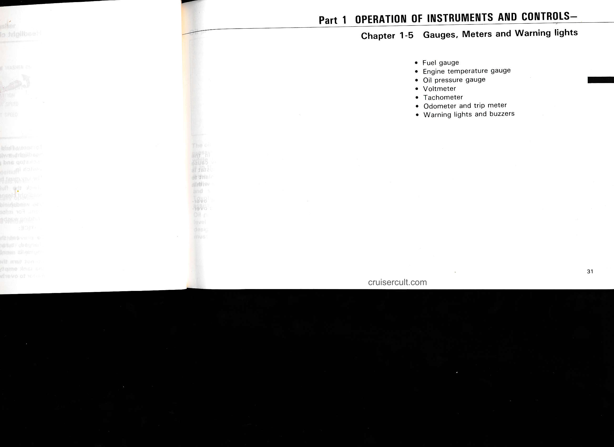
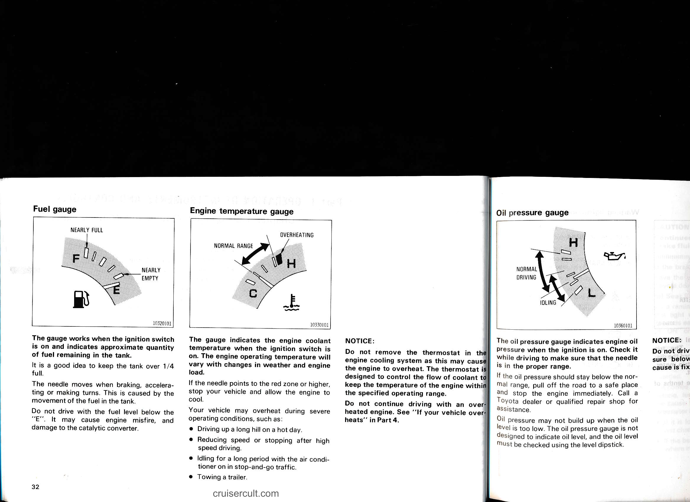
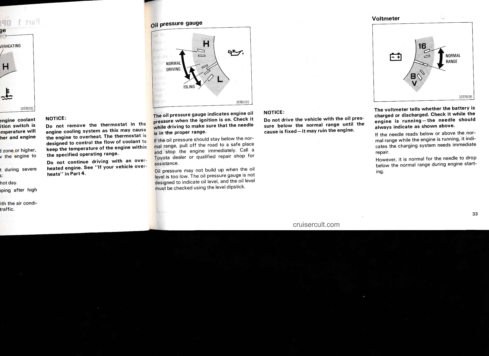
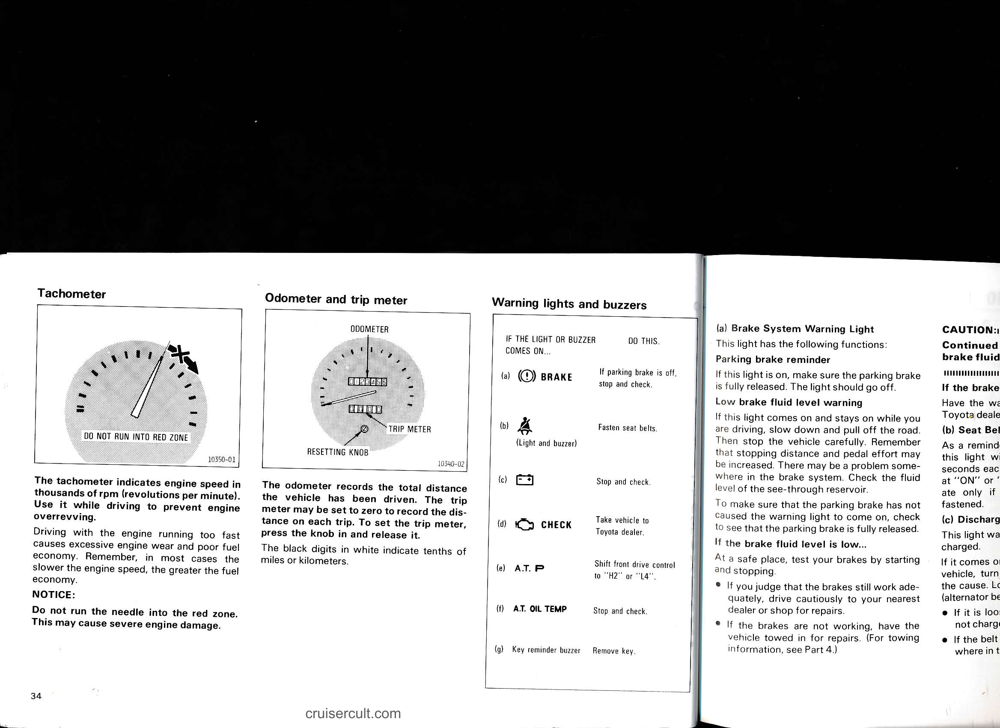
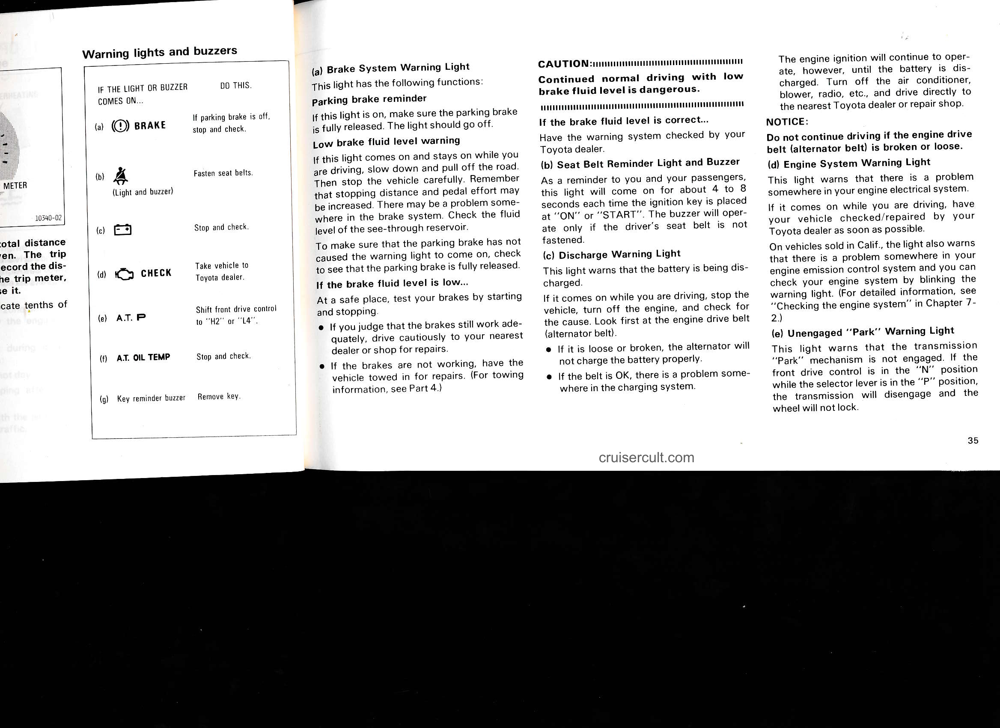

# 1-5. Gauges, Meters and Warning Lights

## Page 31

# Part 1  OPERATION OF INSTRUMENTS AND CONTROLS—

## Chapter 1-5  Gauges, Meters and Warning lights

- Fuel gauge
- Engine temperature gauge
- Oil pressure gauge
- Voltmeter
- Tachometer
- Odometer and trip meter
- Warning lights and buzzers

cruisercult.com  
31

---

## Page 32

# Fuel gauge

The gauge works when the ignition switch is on and indicates approximate quantity of fuel remaining in the tank.

It is a good idea to keep the tank over 1/4 full.

The needle moves when braking, accelerating or making turns. This is caused by the movement of the fuel in the tank.

Do not drive with the fuel level below the "E". It may cause engine misfire, and damage to the catalytic converter.

---

# Engine temperature gauge

The gauge indicates the engine coolant temperature when the ignition switch is on. The engine operating temperature will vary with changes in weather and engine load.

If the needle points to the red zone or higher, stop your vehicle and allow the engine to cool.

Your vehicle may overheat during severe operating conditions, such as:
- Driving up a long hill on a hot day.
- Reducing speed or stopping after high speed driving.
- Idling for a long period with the air conditioner on in stop-and-go traffic.
- Towing a trailer.

**NOTICE:**

Do not remove the thermostat in the engine cooling system as this may cause the engine to overheat. The thermostat is designed to control the flow of coolant to keep the temperature of the engine within the specified operating range.

Do not continue driving with an over-heated engine. See "If your vehicle overheats" in Part 4.

---

# Oil pressure gauge

The oil pressure gauge indicates engine oil pressure when the ignition is on. Check it while driving to make sure that the needle is in the proper range.

If the oil pressure should stay below the normal range, pull off the road to a safe place and stop the engine immediately. Call a Toyota dealer or qualified repair shop for assistance.

Oil pressure may not build up when the oil level is too low. The oil pressure gauge is not designed to indicate oil level, and the oil level must be checked using the level dipstick.

---

32

cruisercult.com

---

## Page 33

## NOTICE:
Do not remove the thermostat in the engine cooling system as this may cause the engine to overheat. The thermostat is designed to control the flow of coolant to keep the temperature of the engine within the specified operating range.

Do not continue driving with an overheated engine. See "If your vehicle overheats" in Part 4.

---

## Oil pressure gauge

The oil pressure gauge indicates engine oil pressure when the ignition is on. Check it while driving to make sure that the needle is in the proper range.

If the oil pressure should stay below the normal range, pull off the road to a safe place and stop the engine immediately. Call a Toyota dealer or qualified repair shop for assistance.

Oil pressure may not build up when the oil level is too low. The oil pressure gauge is not designed to indicate oil level, and the oil level must be checked using the level dipstick.

### NOTICE:
Do not drive the vehicle with the oil pressure below the normal range until the cause is fixed - it may ruin the engine.

---

## Voltmeter

The voltmeter tells whether the battery is charged or discharged. Check it while the engine is running - the needle should always indicate as shown above.

If the needle reads below or above the normal range while the engine is running, it indicates the charging system needs immediate repair.

However, it is normal for the needle to drop below the normal range during engine starting.

---

cruisercult.com

33

---

## Page 34

# Tachometer

![tachometer image]

The tachometer indicates engine speed in thousands of rpm (revolutions per minute). Use it while driving to prevent engine overrevving.

Driving with the engine running too fast causes excessive engine wear and poor fuel economy. Remember, in most cases the slower the engine speed, the greater the fuel economy.

NOTICE:  
Do not run the needle into the red zone.  
This may cause severe engine damage.

---

# Odometer and trip meter

![odometer image]

The odometer records the total distance the vehicle has been driven. The trip meter may be set to zero to record the distance on each trip. To set the trip meter, press the knob in and release it.

The black digits in white indicate tenths of miles or kilometers.

---

# Warning lights and buzzers

IF THE LIGHT OR BUZZER COMES ON... | DO THIS.
--- | ---
(a) (BRAKE) | If parking brake is off, stop and check.
(b) (Light and buzzer) | Fasten seat belts.
(c) (battery) | Stop and check.
(d) CHECK | Take vehicle to Toyota dealer.
(e) A.T. P | Shift front drive control to "H2" or "L4".
(f) A.T. OIL TEMP | Stop and check.
(g) Key reminder buzzer | Remove key.

---

# (a) Brake System Warning Light

This light has the following functions:

Parking brake reminder

If this light is on, make sure the parking brake is fully released. The light should go off.

Low brake fluid level warning

If this light comes on and stays on while you are driving, slow down and pull off the road. Then stop the vehicle carefully. Remember that stopping distance and pedal effort may be increased. There may be a problem somewhere in the brake system. Check the fluid level of the see-through reservoir.

To make sure that the parking brake has not caused the warning light to come on, check to see that the parking brake is fully released.

If the brake fluid level is low...

At a safe place, test your brakes by starting and stopping.

- If you judge that the brakes still work adequately, drive cautiously to your nearest dealer or shop for repairs.  
- If the brakes are not working, have the vehicle towed in for repairs. (For towing information, see Part 4.)

---

34

cruisercult.com

---

## Page 35

# Warning lights and buzzers

IF THE LIGHT OR BUZZER COMES ON... | DO THIS.
--- | ---
(a)  BRAKE | If parking brake is off, stop and check.
(b)  (Light and buzzer) | Fasten seat belts.
(c)  | Stop and check.
(d) CHECK | Take vehicle to Toyota dealer.
(e) A.T. P | Shift front drive control to "H2" or "L4".
(f) A.T. OIL TEMP | Stop and check.
(g) Key reminder buzzer | Remove key.

---

(a) Brake System Warning Light

This light has the following functions:

Parking brake reminder
If this light is on, make sure the parking brake is fully released. The light should go off.

Low brake fluid level warning
If this light comes on and stays on while you are driving, slow down and pull off the road. Then stop the vehicle carefully. Remember that stopping distance and pedal effort may be increased. There may be a problem somewhere in the brake system. Check the fluid level of the see-through reservoir.

To make sure that the parking brake has not caused the warning light to come on, check to see that the parking brake is fully released.

If the brake fluid level is low...
At a safe place, test your brakes by starting and stopping.

- If you judge that the brakes still work adequately, drive cautiously to your nearest dealer or shop for repairs.
- If the brakes are not working, have the vehicle towed in for repairs. (For towing information, see Part 4.)

CAUTION:!!!!!!!!!!!!!!!!!!!!!!!!!!!!!!!!!!!!!!!!!!!!!!!!!!!!!

Continued normal driving with low brake fluid level is dangerous.
!!!!!!!!!!!!!!!!!!!!!!!!!!!!!!!!!!!!!!!!!!!!!!!!!!!!!!!!!!!!!

If the brake fluid level is correct...
Have the warning system checked by your Toyota dealer.

(b) Seat Belt Reminder Light and Buzzer
As a reminder to you and your passengers, this light will come on for about 4 to 8 seconds each time the ignition key is placed at "ON" or "START". The buzzer will operate only if the driver's seat belt is not fastened.

(c) Discharge Warning Light
This light warns that the battery is being discharged.

If it comes on while you are driving, stop the vehicle, turn off the engine, and check for the cause. Look first at the engine drive belt (alternator belt).

- If it is loose or broken, the alternator will not charge the battery properly.
- If the belt is OK, there is a problem somewhere in the charging system.

The engine ignition will continue to operate, however, until the battery is discharged. Turn off the air conditioner, blower, radio, etc., and drive directly to the nearest Toyota dealer or repair shop.

NOTICE:
Do not continue driving if the engine drive belt (alternator belt) is broken or loose.

(d) Engine System Warning Light
This light warns that there is a problem somewhere in your engine electrical system.

If it comes on while you are driving, have your vehicle checked/repaired by your Toyota dealer as soon as possible.

On vehicles sold in Calif., the light also warns that there is a problem somewhere in your engine emission control system and you can check your engine system by blinking the warning light. (For detailed information, see "Checking the engine system" in Chapter 7-2.)

(e) Unengaged "Park" Warning Light
This light warns that the transmission "Park" mechanism is not engaged. If the front drive control is in the "N" position while the selector lever is in the "P" position, the transmission will disengage and the wheel will not lock.

cruisercult.com

35

---

## Page 36

To restore the park function, shift the front drive control either to "H2" or "L4".

### (f) Automatic Transmission Fluid Temperature Warning Light
This light warns that the automatic transmission fluid temperature is high.

If this light comes on while you are driving, slow down and pull off the road, put the selector lever in "P" and leave the engine idling until the light goes off. If the light goes off, you can start the vehicle again. If the light does not go off, call a Toyota dealer or qualified repair shop for assistance.

### (g) Key Reminder Buzzer
This buzzer reminds you to remove the key when you open the driver's door with the ignition key in the "ACC" or "LOCK" position.

How to check all the warning lights:
1. Apply the parking brake.  
2. Place the transfer in "N" position and the transmission in "P" position.  
3. Turn the ignition key to "ON", but do not start the engine.

All the warning lights should come on.

If any warning light or buzzer does not function, either the bulb is burned out or the circuit is in need of repair. Have it checked as soon as possible.

36  
cruisercult.com

Part 1  
Chapter 1-6

---

