# 1-6. Ignition Switch, Transmission and Parking Brake

## Page 37

# Part 1 OPERATION OF INSTRUMENTS AND CONTROLS—

## Chapter 1-6 Ignition switch, Transmission and Parking brake

- Ignition switch with steering lock
- Throttle button
- Automatic transmission
- Four-wheel drive system
- Differential locks
- Parking brake

cruisercult.com

37

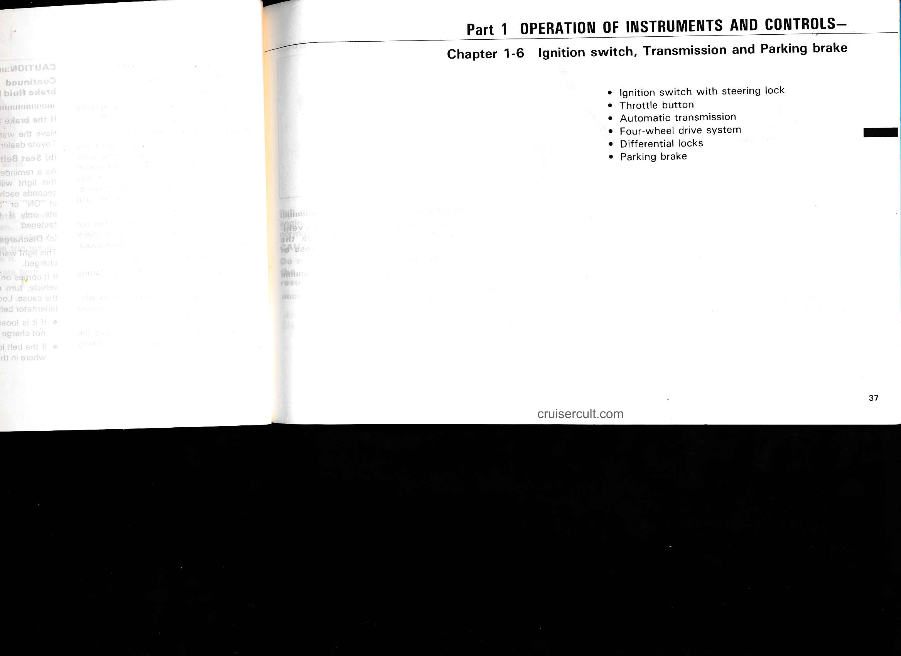

---

## Page 38

# Ignition switch with steering lock

"START" — Starter motor on. The key will return to the "ON" position when released.

For starting tips, see Part 3.

"ON" — Engine on and all accessories on.

This is the normal driving position.

NOTICE:  
Do not leave the key in the "ON" position if the engine is not running. The battery will discharge and the ignition could be damaged.

"ACC" — Accessories such as the radio operate, but the engine is off.

If you leave the key in the "ACC" or "LOCK" position and open the driver's door, a buzzer will remind you to remove the key.

"LOCK" — Engine is off and the steering wheel is locked. The key can be removed only at this position.

You must press in the lock release button to turn the key from "ON" or "ACC" to the "LOCK" position. When starting the engine, the key may seem stuck at the "LOCK" position. To free it, first be sure the key is pushed all the way in, and then rock the steering wheel slightly while turning the key gently.

If, in an emergency, you must turn the engine off while the vehicle is in motion, turn the key only to "ACC".

CAUTION:  
Never remove the key when the vehicle is moving, as this will lock the steering wheel and result in loss of steering control.

---

# Throttle button

Pull out the throttle button to increase engine speed. To return the engine to the normal idle speed, push the button in.

CAUTION:  
Do not use the throttle button when the vehicle is moving. This could result in longer stopping distance.

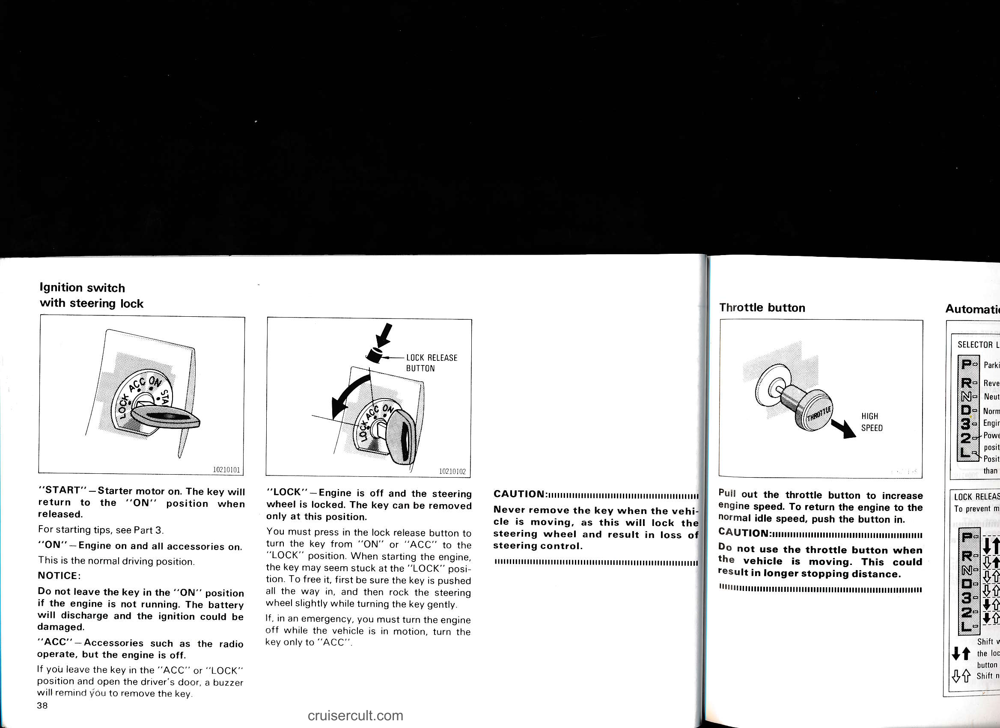

---

## Page 39

# Throttle button

![throttle button illustration]

Pull out the throttle button to increase engine speed. To return the engine to the normal idle speed, push the button in.

CAUTION:
Never remove the key when the vehicle is moving, as this will lock the steering wheel and result in loss of steering control.

CAUTION:
Do not use the throttle button when the vehicle is moving. This could result in longer stopping distance.

HIGH SPEED

---

# Automatic transmission

## SELECTOR LEVER
- P — Parking and engine starting position  
- R — Reverse position  
- N — Neutral position  
- D — Normal driving position  
- 3 — Engine braking and climbing a gentle slope  
- 2 — Powerful engine braking and hill climbing position  
- L — Position for stronger engine braking than that in "2" range and for hard towing

## LOCK RELEASE BUTTON
To prevent misshifting

- Shift while holding the lock release button in  
- Shift normally

(illustrations of selector positions and shift lever)

20041101

---

The following has been prepared in order to familiarize you with the correct operating procedures for pleasant fun-filled driving.
- (a) Normal driving
- (b) Using engine braking
- (c) Using the "3", "2" and "L" ranges
- (d) Backing up
- (e) Parking
- (f) Good driving practice

cruisercult.com

39

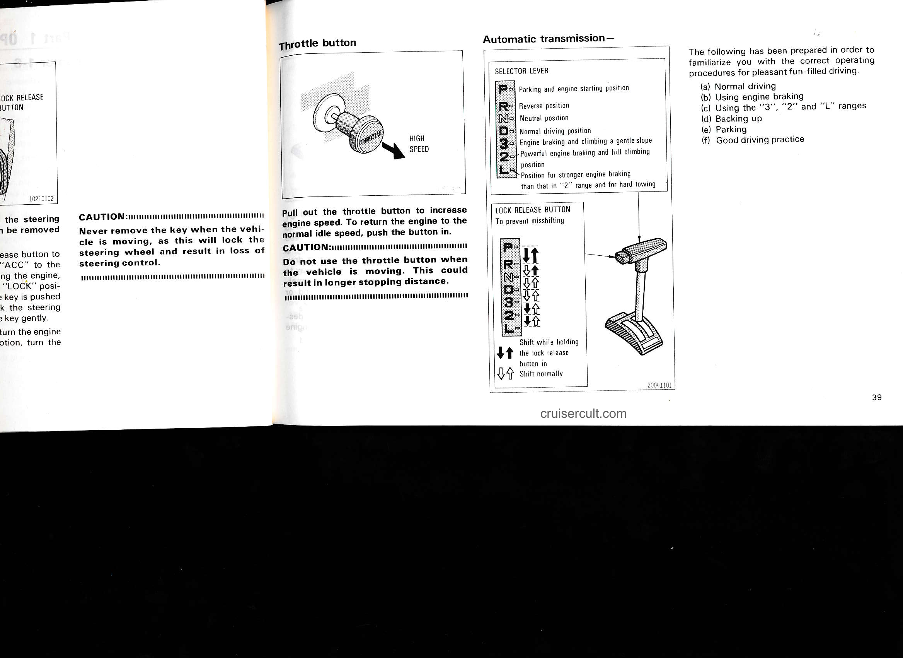

---

## Page 40

# (a) Normal driving

![gear selector diagram]

P ← "P" (Park) range  
← "N" (Neutral) range

PARKING BRAKE LEVER SELECTOR LEVER BRAKE PEDAL  
ACCELERATOR PEDAL

← "D" (Drive) range

1. Start the engine as instructed in "How to start the engine" in Part 3.

The transmission must be in "P" or "N". The engine will not start in "R", "3", "2", "L" or "D" range even if the key is turned.

2. With your foot holding down the brake pedal, shift the selector lever to "D".

CAUTION:
Never put your foot on the accelerator pedal while shifting.

3. Release the parking brake and brake pedal. Depress the accelerator pedal slowly for smooth starting.

The vehicle will start in the first gear and automatically shift to the second, third and overdrive gears according to the vehicle speed.

If you need to accelerate rapidly while driving, push the accelerator pedal all the way to the floor. The transmission will be automatically downshifted to the third, second or first gear, according to the vehicle speed.

If engine braking is needed, such as in descending a long hill, see "(b) Using engine braking."

---

# (b) Using engine braking

![gear selector diagram]

↓ Shifting

"D" (Drive) range  
"3" (Third) range  
"2" (Second) range  
"L" (Low) range

To use the braking power of the engine, downshift the transmission in the way described below:

- Shift into the "3" range when the vehicle speed is lower than 81 mph (130 km/h). The transmission will downshift to the third gear.
- Shift into the "2" range when the vehicle speed is lower than 53 mph (85 km/h). The transmission will downshift to the second gear and more engine braking will be obtained.

---

40

cruisercult.com

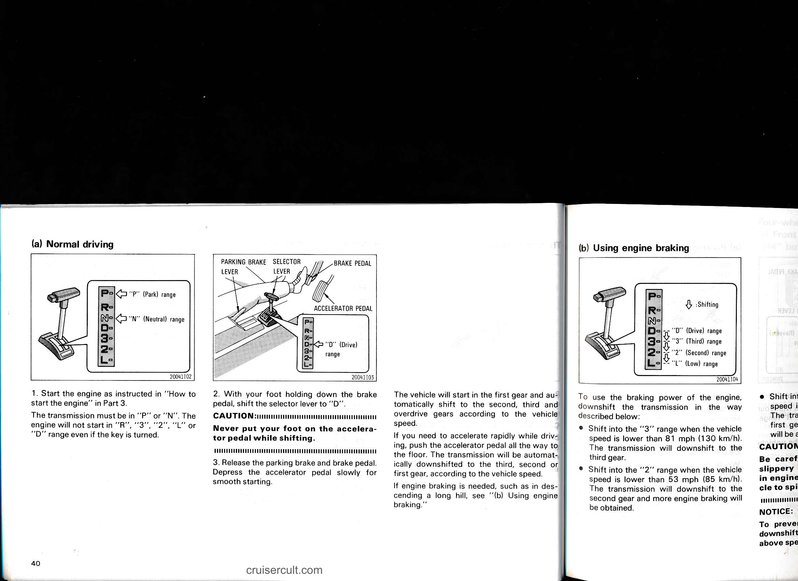

---

## Page 41

The vehicle will start in the first gear and automatically shift to the second, third and overdrive gears according to the vehicle speed.

If you need to accelerate rapidly while driving, push the accelerator pedal all the way to the floor. The transmission will be automatically downshifted to the third, second or first gear, according to the vehicle speed.

If engine braking is needed, such as in descending a long hill, see "(b) Using engine braking."

## (b) Using engine braking

[illustration of shift lever showing positions: P R N D 3 2 L  
Shifting  
"D" (Drive) range  
"3" (Third) range  
"2" (Second) range  
"L" (Low) range]

To use the braking power of the engine, downshift the transmission in the way described below:

- Shift into the "3" range when the vehicle speed is lower than 81 mph (130 km/h). The transmission will downshift to the third gear.

- Shift into the "2" range when the vehicle speed is lower than 53 mph (85 km/h). The transmission will downshift to the second gear and more engine braking will be obtained.

- Shift into the "L" range when the vehicle speed is lower than 25 mph (40 km/h). The transmission will downshift to the first gear and maximum engine braking will be applied.

**CAUTION:**  
Be careful when downshifting on a slippery surface. The abrupt change in engine speed could cause the vehicle to spin or skid.

**NOTICE:**  
To prevent engine overrevving, do not downshift if you are going faster than the above speed in each range.

cruisercult.com

## (c) Using the "3", "2" and "L" ranges

The "3", "2" and "L" ranges are used for strong traction in addition to strong engine braking as described previously. The mechanism for this is that the transmission uses mainly lower gears.

With the selector lever in "3", "2" or "L", you can start the vehicle in motion as with the lever in "D".

With the selector lever in "3", the vehicle will start in the first gear and automatically shift to the second and third gears, but will not shift to the overdrive gear. This provides strong traction such as for climbing a gentle slope.

With the selector lever in "2", the transmission is engaged in the second gear and will not upshift or downshift at all. This provides strong traction such as for hill climbing.

With the selector lever in "L", the transmission is engaged in the first gear and will not upshift at all. This provides maximum traction such as for hard towing.

---

## Page 42

*Page content not yet processed*

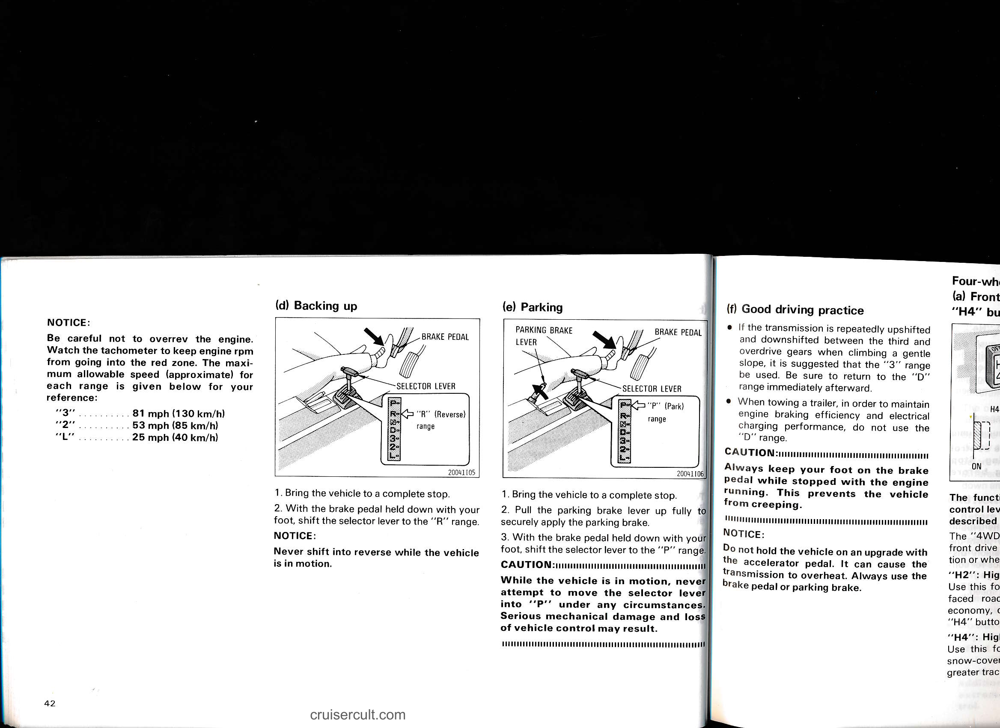

---

## Page 43

*Page content not yet processed*

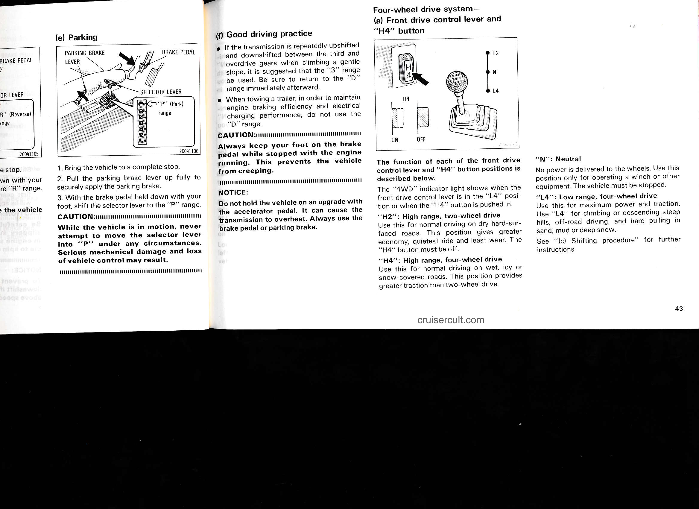

---

## Page 44

*Page content not yet processed*

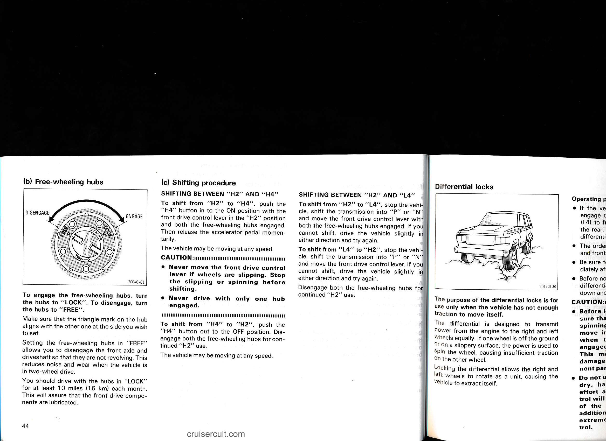

---

## Page 45

*Page content not yet processed*

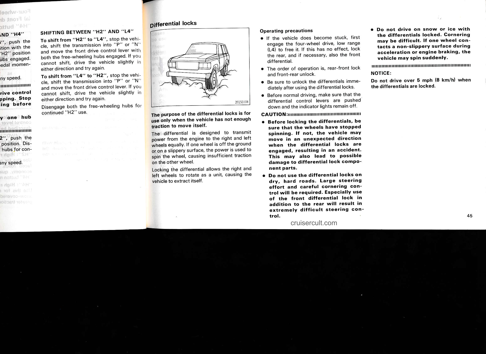

---

## Page 46

*Page content not yet processed*

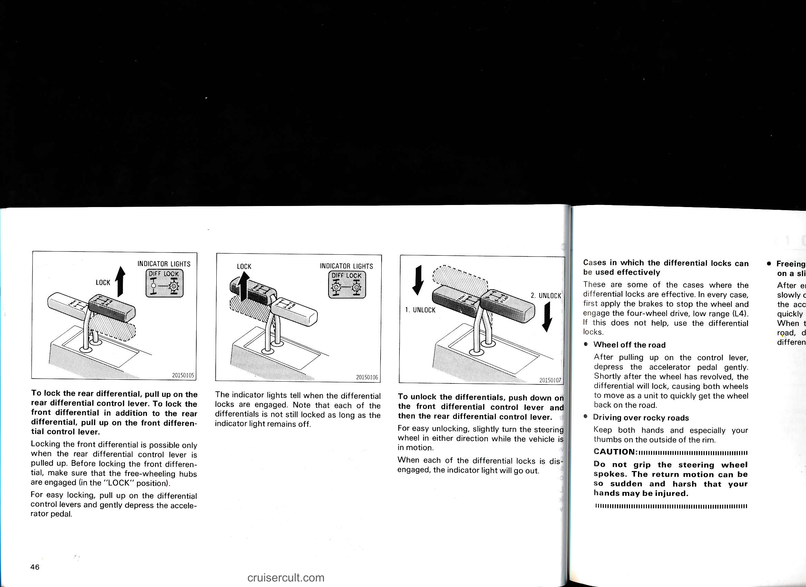

---

## Page 47

*Page content not yet processed*

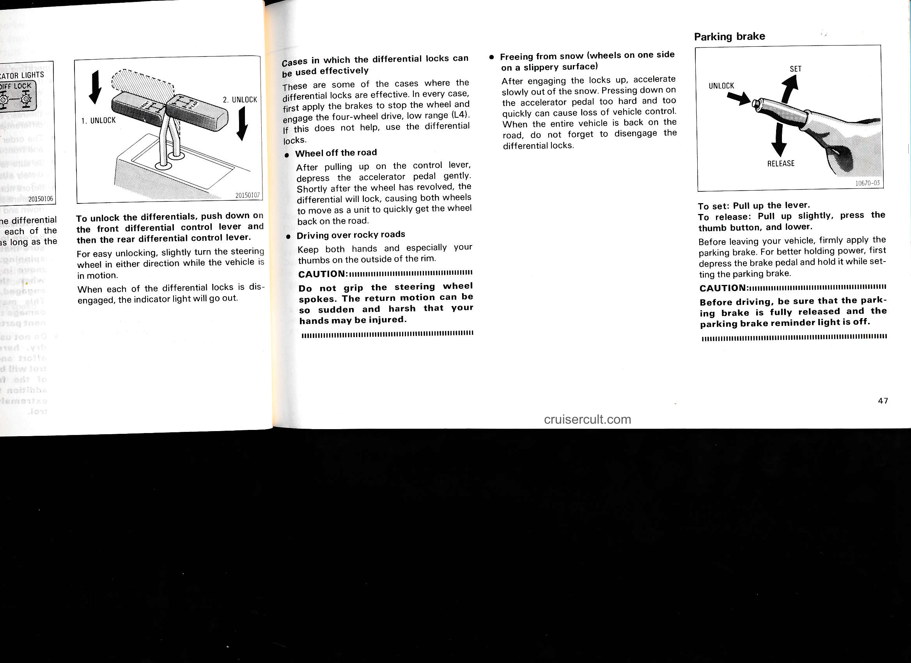

---

## Page 48

*Page content not yet processed*

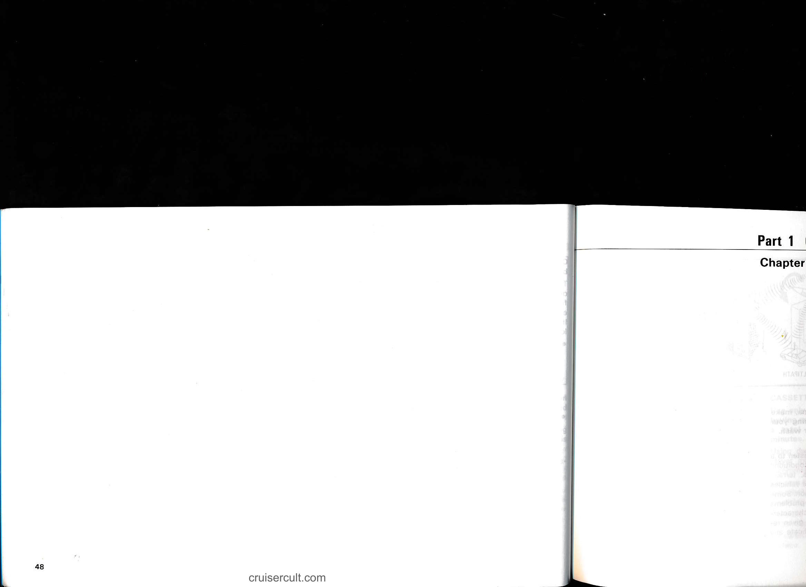

---

