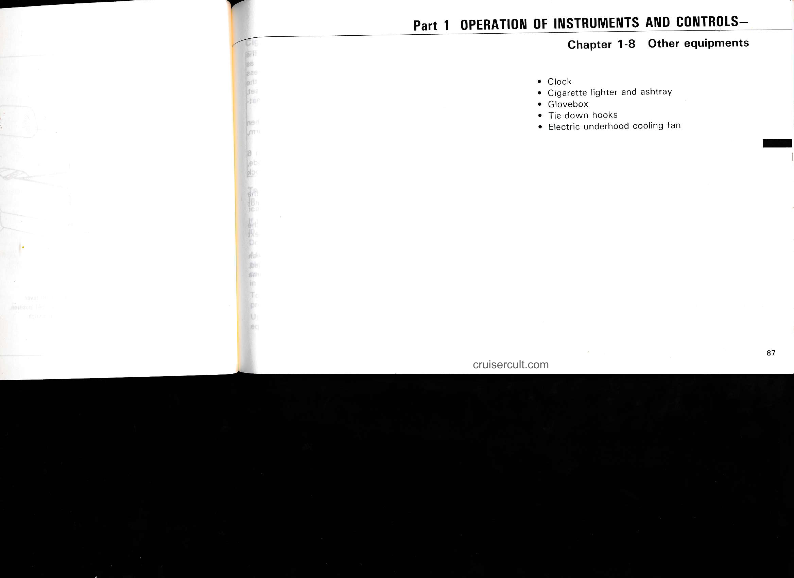
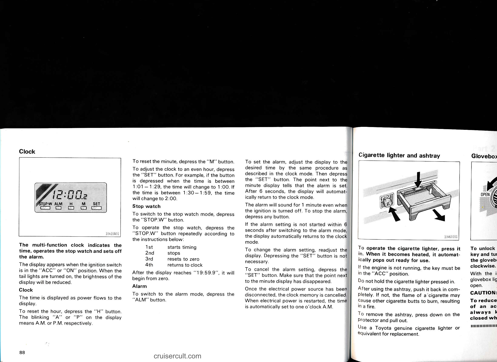
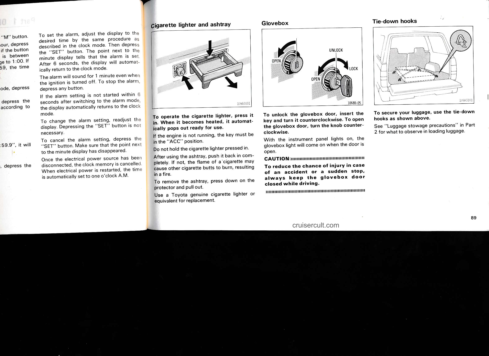
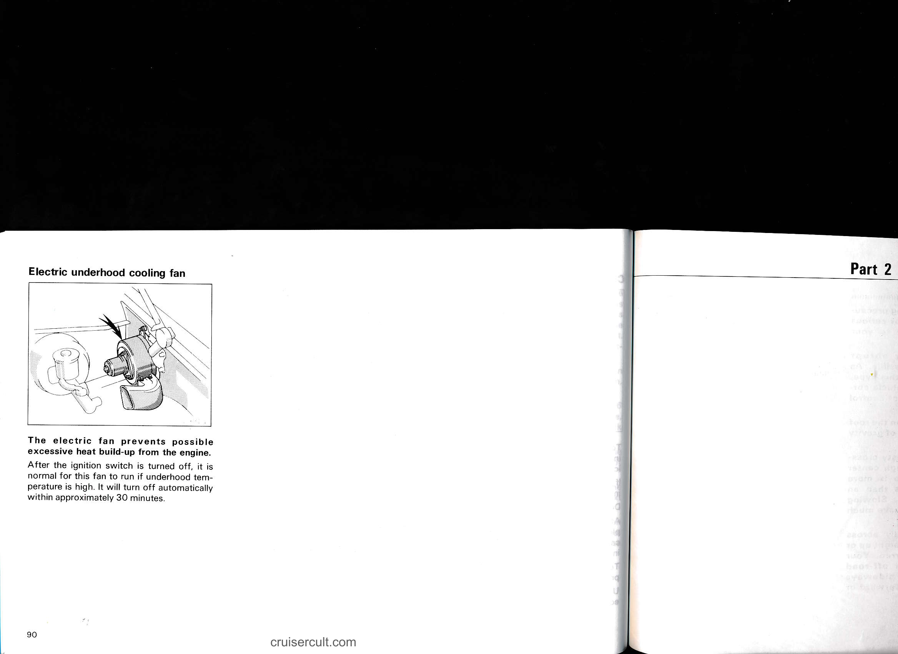

# 1-8. Other Equipment

## Page 87

# Part 1  OPERATION OF INSTRUMENTS AND CONTROLS—

### Chapter 1-8  Other equipments

- Clock
- Cigarette lighter and ashtray
- Glovebox
- Tie-down hooks
- Electric underhood cooling fan

cruisercult.com

87

---

## Page 88

# Clock

The multi-function clock indicates the time, operates the stop watch and sets off the alarm.

The display appears when the ignition switch is in the "ACC" or "ON" position. When the tail lights are turned on, the brightness of the display will be reduced.

## Clock

The time is displayed as power flows to the display.

To reset the hour, depress the "H" button.

The blinking "A" or "P" on the display means A.M. or P.M. respectively.

To reset the minute, depress the "M" button.

To adjust the clock to an even hour, depress the "SET" button. For example, if the button is depressed when the time is between 1:01–1:29, the time will change to 1:00. If the time is between 1:30–1:59, the time will change to 2:00.

## Stop watch

To switch to the stop watch mode, depress the "STOP.W" button.

To operate the stop watch, depress the "STOP.W" button repeatedly according to the instructions below:

1. 1st — starts timing  
2. 2nd — stops  
3. 3rd — resets to zero  
4. 4th — returns to clock

After the display reaches "19:59.9", it will begin from zero.

## Alarm

To switch to the alarm mode, depress the "ALM" button.

To set the alarm, adjust the display to the desired time by the same procedure as described in the clock mode. Then depress the "SET" button. The point next to the minute display tells that the alarm is set. After 6 seconds, the display will automatically return to the clock mode.

The alarm will sound for 1 minute even when the ignition is turned off. To stop the alarm, depress any button.

If the alarm setting is not started within 6 seconds after switching to the alarm mode, the display automatically returns to the clock mode.

To change the alarm setting, readjust the display. Depressing the "SET" button is not necessary.

To cancel the alarm setting, depress the "SET" button. Make sure that the point next to the minute display has disappeared.

Once the electrical power source has been disconnected, the clock memory is cancelled. When electrical power is restarted, the time is automatically set to one o'clock A.M.

---

# Cigarette lighter and ashtray

To operate the cigarette lighter, press it in. When it becomes heated, it automatically pops out ready for use.

If the engine is not running, the key must be in the "ACC" position.

Do not hold the cigarette lighter pressed in.

After using the ashtray, push it back in completely. If not, the flame of a cigarette may cause other cigarette butts to burn, resulting in a fire.

To remove the ashtray, press down on the protector and pull out.

Use a Toyota genuine cigarette lighter or equivalent for replacement.

---

Page 88

cruisercult.com

---

## Page 89

## Clock / Alarm

To set the alarm, adjust the display to the desired time by the same procedure as described in the clock mode. Then depress the "SET" button. The point next to the minute display tells that the alarm is set. After 6 seconds, the display will automatically return to the clock mode.

The alarm will sound for 1 minute even when the ignition is turned off. To stop the alarm, depress any button.

If the alarm setting is not started within 6 seconds after switching to the alarm mode, the display automatically returns to the clock mode.

To change the alarm setting, readjust the display. Depressing the "SET" button is not necessary.

To cancel the alarm setting, depress the "SET" button. Make sure that the point next to the minute display has disappeared.

Once the electrical power source has been disconnected, the clock memory is cancelled. When electrical power is restarted, the time is automatically set to one o'clock A.M.

---

## Cigarette lighter and ashtray

To operate the cigarette lighter, press it in. When it becomes heated, it automatically pops out ready for use.

If the engine is not running, the key must be in the "ACC" position.

Do not hold the cigarette lighter pressed in.

After using the ashtray, push it back in completely. If not, the flame of a cigarette may cause other cigarette butts to burn, resulting in a fire.

To remove the ashtray, press down on the protector and pull out.

Use a Toyota genuine cigarette lighter or equivalent for replacement.

---

## Glovebox

To unlock the glovebox door, insert the key and turn it counterclockwise. To open the glovebox door, turn the knob counterclockwise.

With the instrument panel lights on, the glovebox light will come on when the door is open.

CAUTION:
To reduce the chance of injury in case of an accident or a sudden stop, always keep the glovebox door closed while driving.

---

## Tie-down hooks

To secure your luggage, use the tie-down hooks as shown above.

See "Luggage stowage precautions" in Part 2 for what to observe in loading luggage.

cruisercult.com

89

---

## Page 90

## Electric underhood cooling fan

**The electric fan prevents possible excessive heat build-up from the engine.**

After the ignition switch is turned off, it is normal for this fan to run if underhood temperature is high. It will turn off automatically within approximately 30 minutes.

Part 2

90

cruisercult.com

---

