# Part 2: Information Before Driving Your Toyota

## Page 91

# Part 2 INFORMATION BEFORE DRIVING YOUR TOYOTA

- Off-road vehicle precautions
- Break-in period
- Fuel
- Operation in foreign countries
- Catalytic converters
- Engine exhaust cautions
- Facts about engine oil consumption
- Brake system
- Luggage stowage precautions
- Your Toyota's identification

cruisercult.com

91

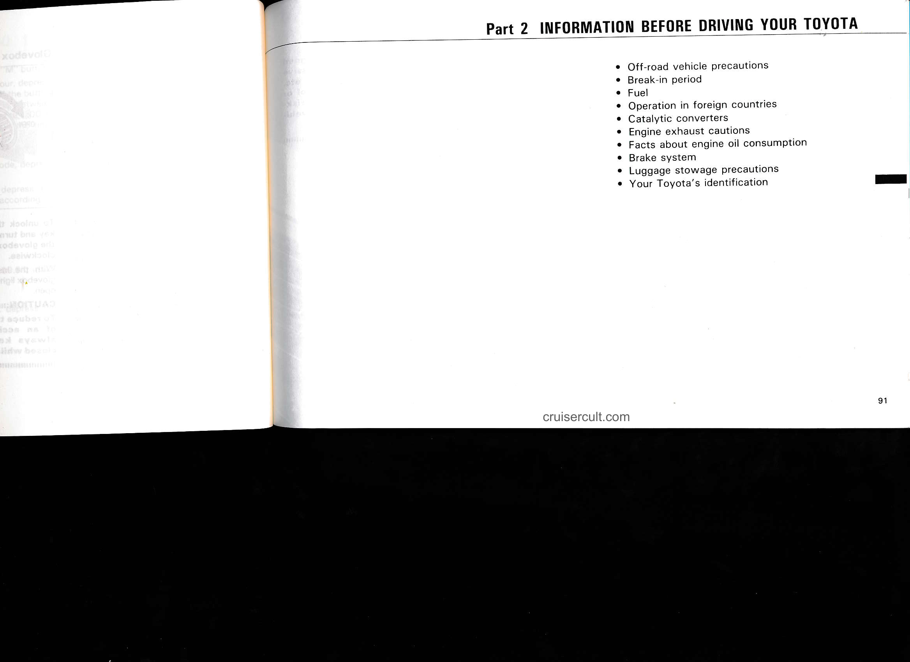

---

## Page 92

# Off-road vehicle precautions

![Illustration of two vehicles]

2010/01

This vehicle is one of the class of vehicles which have higher ground clearance and narrower tread in relation to the height of their center of gravity to make them capable of performing in a wide variety of off-road applications. Specific design characteristics give it a higher

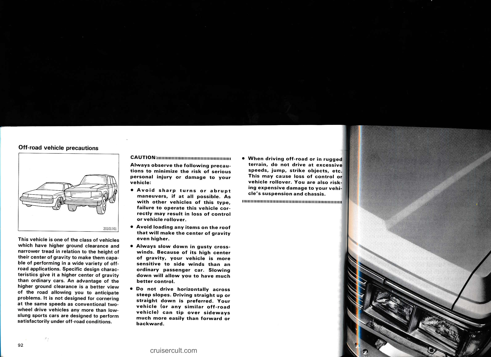

---

## Page 92.1 (unnumbered)

- When driving off-road or in rugged terrain, do not drive at excessive speeds, jump, strike objects, etc. This may cause loss of control or vehicle rollover. You are also risking expensive damage to your vehicle's suspension and chassis.

# You should know as much about the repair and maintenance of your new Land Cruiser as the people who built it.

cruisercult.com

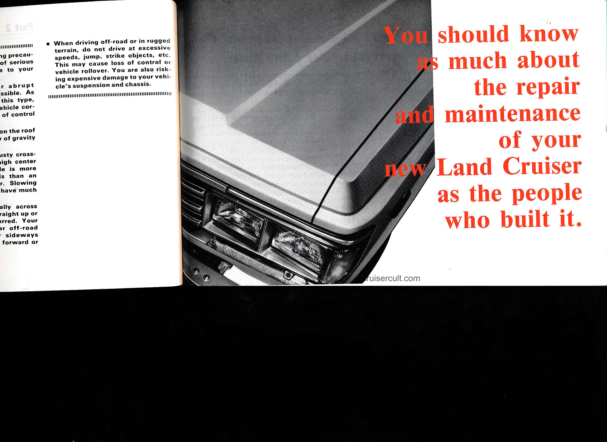

---

## Page 92.2 (unnumbered)

# The Toyota authorized 1989 Land Cruiser Repair Manual tells you how to maintain your Land Cruiser, diagnose problems, and perform your own maintenance and repair work.

The best way to keep your new Land Cruiser in top running order is to maintain it properly from the moment you drive it off the showroom floor and to make repairs promptly when problems arise.

The Toyota authorized 1989 Land Cruiser Repair Manual helps you do both. It's packed with literally everything you need to know to perform your own maintenance and repair in virtually every area of your new Land Cruiser.

![open manual illustration]

## Maintenance and repair procedures for the engine, chassis, body, electrical system, and more, are clearly explained and illustrated.

cruisercult.com

---

## Periodic maintenance and tune-up

Periodic maintenance and tune-up helps to prevent small problems from growing into larger ones later on. The repair manual outlines exactly what maintenance is required, provides a schedule for its performance, and clearly explains how to do the work yourself step-by-step.

Areas covered include such things as spark plug replacement, valve clearance adjustment, ignition timing inspection, and engine oil and filter replacement.

## Comprehensive troubleshooting section

Comprehensive troubleshooting tables are listed for each area of your new Land Cruiser where problems could arise. These tables will help you diagnose and find the cause of the problem should one occur.

The repair procedures for each problem's probable cause are listed in a remedy column to quickly lead you to the problem's solution.

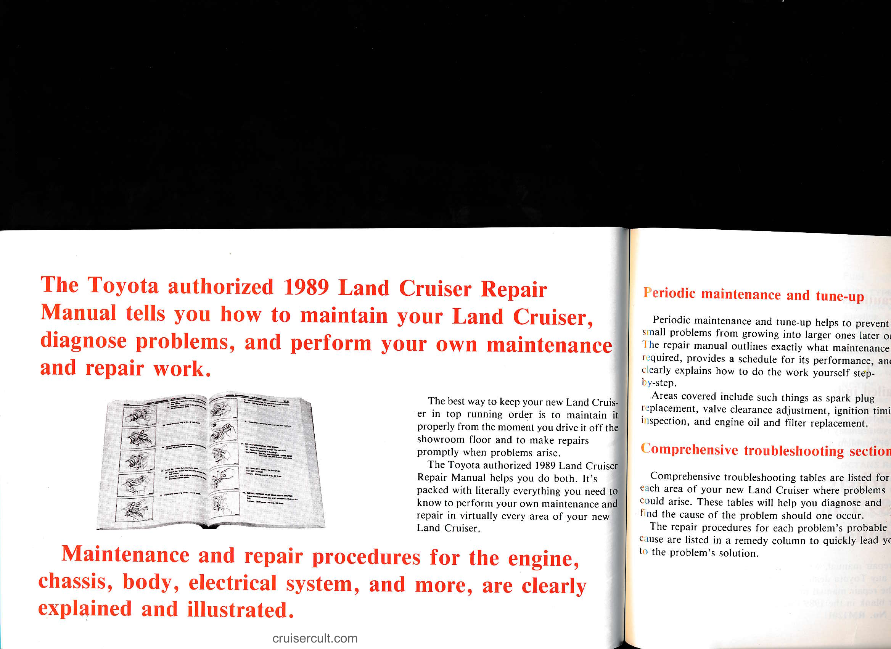

---

## Page 92.3 (unnumbered)

# and Cruiser Repair  
# in your Land Cruiser,  
# in your own maintenance

The best way to keep your new Land Cruiser in top running order is to maintain it properly from the moment you drive it off the showroom floor and to make repairs promptly when problems arise.

The Toyota authorized 1989 Land Cruiser Repair Manual helps you do both. It's packed with literally everything you need to know to perform your own maintenance and repair in virtually every area of your new Land Cruiser.

## Periodic maintenance and tune-up

Periodic maintenance and tune-up helps to prevent small problems from growing into larger ones later on. The repair manual outlines exactly what maintenance is required, provides a schedule for its performance, and clearly explains how to do the work yourself step-by-step.

Areas covered include such things as spark plug replacement, valve clearance adjustment, ignition timing inspection, and engine oil and filter replacement.

## Comprehensive troubleshooting section

Comprehensive troubleshooting tables are listed for each area of your new Land Cruiser where problems could arise. These tables will help you diagnose and find the cause of the problem should one occur.

The repair procedures for each problem's probable cause are listed in a remedy column to quickly lead you to the .problem's solution.

## Special tools and test equipment

Special tools and test equipment designed for use with the 1989 Land Cruiser's individual components are listed on SST AND SSM Section.

Special service tools (SST) should be used where specified. But, if an SST is not available, the manual lists a commercial tool equivalent that may be used if possible. The tools are also listed at each step in the repair process instructions where their use is required.

## Illustrated repair procedures

In addition to clearly written repair instructions, each repair section is amply illustrated to identify the repair components and show how they fit together.

Here's an example:

- Fan
- Fluid Coupling
- Water Pump Pulley
- Water Pump Assembly
- Gasket

cruisercult.com

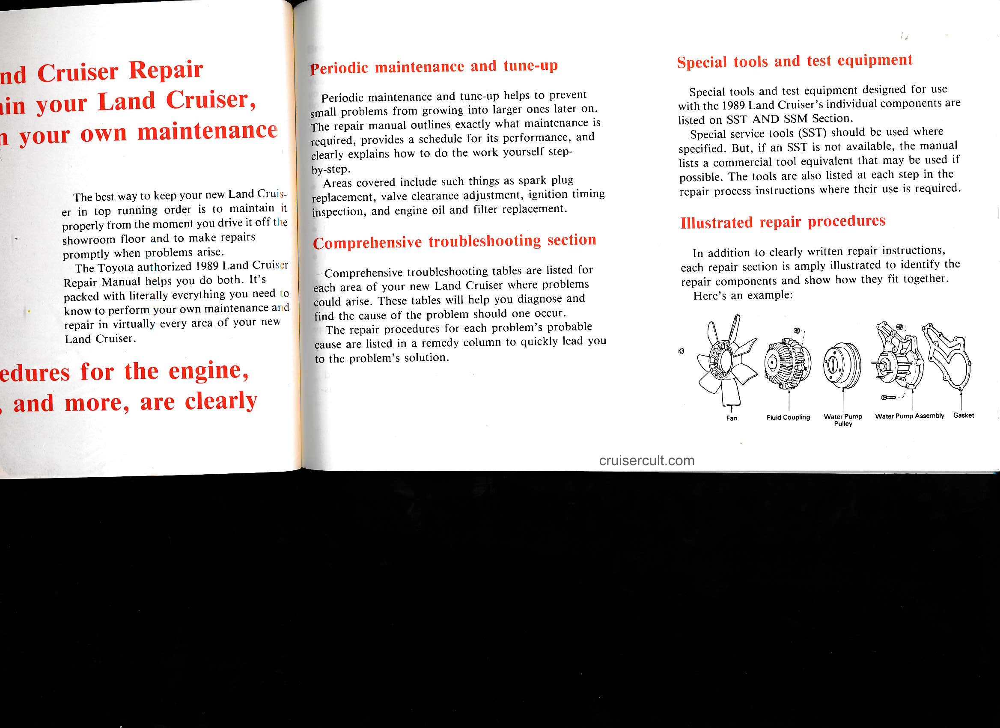

---

## Page 92.4 (unnumbered)

Each repair procedure is presented step-by-step.
The illustration is there to show you what to do and where
to do it.
A task heading shows you what it is that you are doing.
And detailed text tells how to perform the repair work as
well as giving other information such as specifications and
precautionary information.
Here's an example:

Illustration:
what to do and where

Task heading:
what to do

Detail text:
how to do it

Specification

INSTALL DRIVE SHAFT ON CENTER SUPPORT BEAR-
ING FLANGE

(a) Align the marks on the flanges and con-
nect the flanges with four bolts and nuts.
(b) Torque the bolts and nuts.

Torque: 2.0–4.0 kg-m (15–28 ft-lb, 20–39 N·m)

cruisercult.com

Precautions

At the beginning of each section precautions are given
that pertain to all repair operations listed in the section.
These precautions, which should be read before starting
repairs, are meant to help you avoid costly errors.

Detailed index

An index is provided on the first page of each section to
guide you quickly to the page containing repair informa-
tion for problem areas.

Where to obtain the
1989 Land Cruiser Repair
Manual

The repair manual, written in English, may be purchased
from any Toyota dealer. On the U.S. mainland and Alas-
ka, the repair manual may be ordered by mail using the
order blank in the 1989 Owner's Guide.
Pub. No. RM120U

Break-in period

Drive gently and avoid high speeds.

You need not follow a break-in schedule with
your new Toyota. But following a few simple
tips for the first 1000 miles (1600 km) can
add to the future economy and long life of
your vehicle:
- Do not drive over 55 mph (88 km/h).
- Avoid overrevving. Maintain engine speed
  between 2000 and 4000 rpm.
- Avoid full-throttle starts.
- Try to avoid hard stops during the first
  200 miles (300 km).
- Do not drive for a long time at any single
  speed, either fast or slow.
- Do not tow a trailer during the first 500
  miles (800 km).

We recommend that for the first 300 miles
(500 km) you place the front drive control
lever in the "H2" position and lock both free-
wheeling hubs. For detailed information, see
"Four-wheel drive system" and "Free-
wheeling hubs" in Chapter 1-6.

Fuel

FUEL TYPE

Your new ve... gasoline.

To help pres... Toyota has a ... The special ... fuel will fit ... on pumps w...

NOTICE:
Do not use le... gasoline will ... to lose its eff... control sys...
Also, this w... costs.

OCTANE RA...
Select Reco... Rating 87) ...

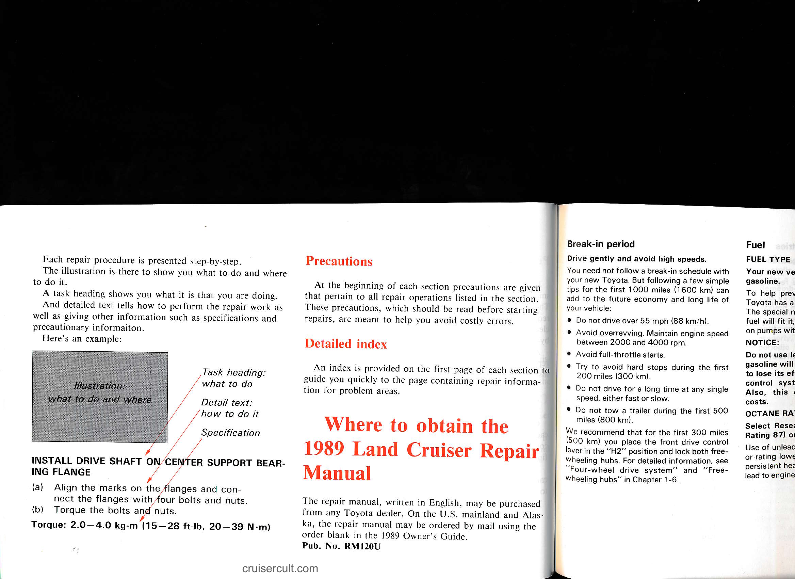

---

## Page 93

# Precautions

At the beginning of each section precautions are given which pertain to all repair operations listed in the section. These precautions, which should be read before starting repairs, are meant to help you avoid costly errors.

# Detailed index

An index is provided on the first page of each section to guide you quickly to the page containing repair information for problem areas.

# Where to obtain the 1989 Land Cruiser Repair Manual

The repair manual, written in English, may be purchased from any Toyota dealer. On the U.S. mainland and Alaska the repair manual may be ordered by mail using the order blank in the 1989 Owner's Guide. Pub. No. RM120U

# Break-in period

Drive gently and avoid high speeds.

You need not follow a break-in schedule with your new Toyota. But following a few simple tips for the first 1000 miles (1600 km) can add to the future economy and long life of your vehicle:
- Do not drive over 55 mph (88 km/h).
- Avoid overrevving. Maintain engine speed between 2000 and 4000 rpm.
- Avoid full-throttle starts.
- Try to avoid hard stops during the first 200 miles (300 km).
- Do not drive for a long time at any single speed, either fast or slow.
- Do not tow a trailer during the first 500 miles (800 km).

We recommend that for the first 300 miles (500 km) you place the front drive control lever in the "H2" position and lock both free-wheeling hubs. For detailed information, see "Four-wheel drive system" and "Free-wheeling hubs" in Chapter 1-6.

# Fuel

## FUEL TYPE

Your new vehicle must use only unleaded gasoline.

To help prevent gas station mixups, your Toyota has a new smaller fuel tank opening. The special nozzle on pumps with unleaded fuel will fit it, but the larger standard nozzle on pumps with leaded gas will not.

**NOTICE:**
Do not use leaded gasoline. Use of leaded gasoline will cause the catalytic converter to lose its effectiveness and the emission control system to function improperly. Also, this can increase maintenance costs.

## OCTANE RATING

Select Research Octane No. 91 (Octane Rating 87) or higher.

Use of unleaded fuel with an octane number or rating lower than stated above will cause persistent heavy knocking. If severe, this will lead to engine damage.

# If your engine knocks...

If you detect heavy knocking even when using the recommended fuel, or if you hear steady knocking while holding a steady speed on level roads, consult your Toyota dealer.

However, now and then, you may notice light knocking for a short time while accelerating or driving up hills. This is no cause for concern.

## GASOLINES CONTAINING ALCOHOL

If you use gasohol in your Toyota, be sure that it is unleaded, has an octane rating no lower than 87 and does not contain more than 10% ethanol. Toyota does not recommend the use of gasolines containing methanol.

Gasohol is a mixture of gasoline and ethanol.

If you use gasoline containing methanol, use only gasoline meeting the requirements above and also containing less than 5% methanol with cosolvents and corrosion inhibitors for methanol.

cruisercult.com

93

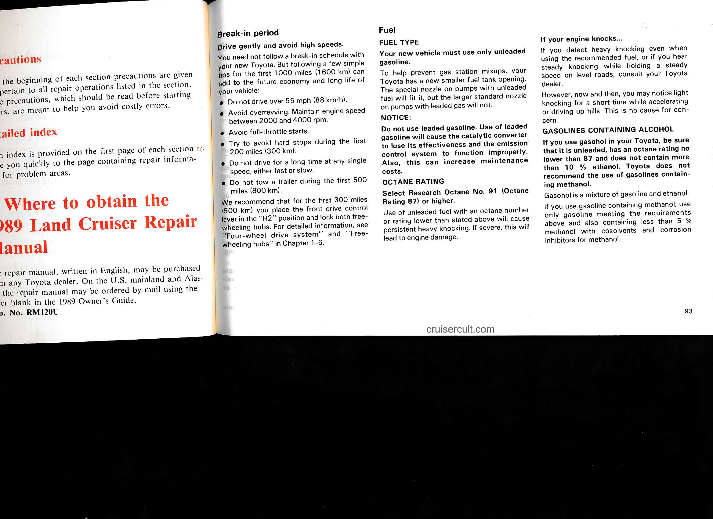

---

## Page 94

### NOTICE:
Do not use gasohol other than stated above. It will cause fuel system damage or vehicle performance problems.  
If driveability problems are encountered (poor hot starting, vaporizing, engine knock, etc.), discontinue the use.  
Take care not to spill gasohol during refueling. Gasoline containing alcohol may cause paint damage.

**FUEL TANK CAPACITY**  
23.8 gal. (19.8 Imp. gal., 90 liters)

---

### Operation in foreign countries
If you plan to drive your Toyota in another country...

First, comply with the vehicle registration laws.

Second, confirm the availability of the correct fuel (unleaded and minimum octane rating).

---

### Catalytic converters

CATALYTIC CONVERTERS

The catalytic converter is an emission control device installed in the exhaust system.

It looks somewhat like a muffler, but its purpose is to reduce pollutants in the exhaust gas.

**CAUTION:**  
- Keep people and combustible materials away from the exhaust pipe while the engine is running. The exhaust gas is very hot.  
- Do not idle or park your vehicle over anything that might burn easily such as grass, leaves, paper or rags.

---

### NOTICE:
A large amount of unburned gas flowing into the converter may cause it to overheat and create a fire hazard. To prevent this and other damage, observe the following precautions:

- Use only unleaded gasoline.  
- Do not drive with an extremely low fuel level; running out of gas could cause the engine to misfire, creating an excessive load on the converter.  
- Do not allow the engine to run at idle speed for more than 20 minutes.  
- Avoid racing the engine.  
- Do not push-start or pull-start your vehicle.  
- Do not turn off the ignition while the vehicle is moving.  
- Keep your engine in good running order. Malfunctions in the engine electrical, ignition or fuel systems could cause an extremely high converter temperature.

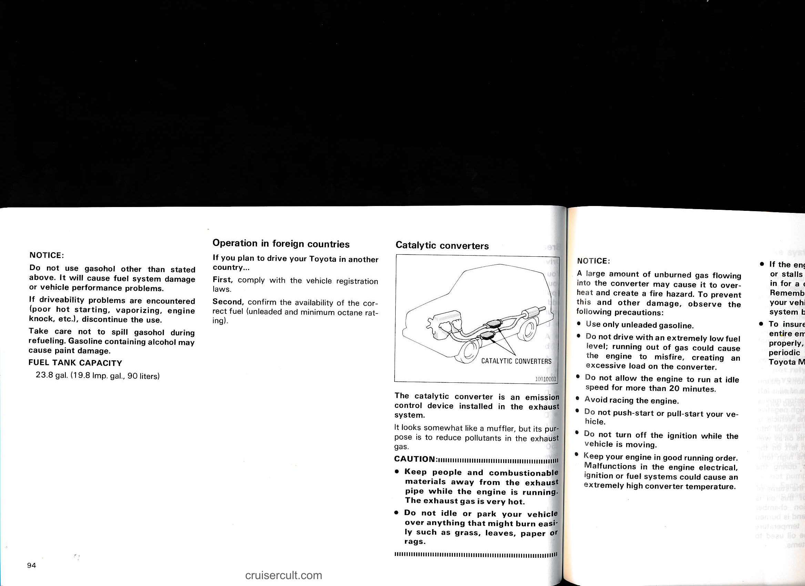

---

## Page 95

# Catalytic converters

![CATALYTIC CONVERTERS]

The catalytic converter is an emission control device installed in the exhaust system.

It looks somewhat like a muffler, but its purpose is to reduce pollutants in the exhaust gas.

**CAUTION:**
- Keep people and combustible materials away from the exhaust pipe while the engine is running. The exhaust gas is very hot.
- Do not idle or park your vehicle over anything that might burn easily such as grass, leaves, paper or rags.

---

## NOTICE:

A large amount of unburned gas flowing into the converter may cause it to overheat and create a fire hazard. To prevent this and other damage, observe the following precautions:

- Use only unleaded gasoline.
- Do not drive with an extremely low fuel level; running out of gas could cause the engine to misfire, creating an excessive load on the converter.
- Do not allow the engine to run at idle speed for more than 20 minutes.
- Avoid racing the engine.
- Do not push-start or pull-start your vehicle.
- Do not turn off the ignition while the vehicle is moving.
- Keep your engine in good running order. Malfunctions in the engine electrical, ignition or fuel systems could cause an extremely high converter temperature.
- If the engine becomes difficult to start or stalls frequently, take your vehicle in for a check-up as soon as possible. Remember, your Toyota dealer knows your vehicle and its catalytic converter system best.
- To insure that the converter and the entire emission control system operate properly, your vehicle must receive the periodic inspections required by the Toyota Maintenance Schedule.

---

# Engine exhaust cautions

**CAUTION:**
- Avoid inhaling the engine exhaust. It contains carbon monoxide, which is a colorless and odorless gas. It can cause unconsciousness or even death.
- Make sure the exhaust system has no holes or loose connections. The system should be checked from time to time. If you hit something, or notice a change in the sound of the exhaust, have the system checked immediately.
- Do not run the engine in a garage or enclosed area except for the time needed to drive the vehicle in or out. The exhaust gases cannot escape, making this a particularly dangerous situation.
- Do not remain for a long time in a parked vehicle with the engine running. If it is unavoidable, however, do so only in an unconfined area and adjust the heating or cooling system to force outside air into the vehicle.

cruisercult.com

95

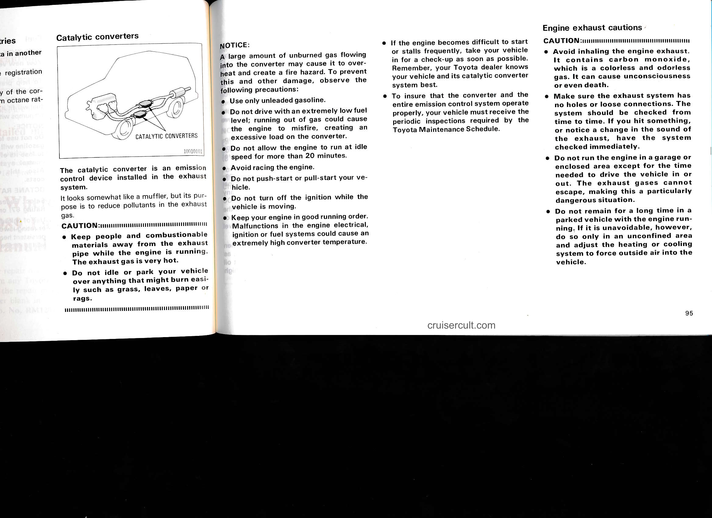

---

## Page 96

- Keep the trunk lid, back hatch or tailgate closed while driving. An open or unsealed trunk lid, back hatch or tailgate may cause exhaust gases to be drawn into the vehicle. If you must drive with the trunk lid, back hatch or tailgate open to accommodate a large object, close the windows, open all the dashboard vents and have the heating or cooling system deliver fresh air into the vehicle by turning the fan on high speeds with the air intake control set at the "FRESH" or OUTSIDE AIR position.
- To allow proper operation of your vehicle's ventilation system, keep the inlet grilles in front of the windshield clear of snow, leaves, or other obstructions.
- If you smell exhaust fumes in the vehicle, drive with the windows open and the trunk lid, back hatch or tailgate closed. Have the cause immediately located and corrected.

Facts about engine oil consumption
=================================

FUNCTIONS OF ENGINE OIL
-----------------------

Engine oil has the primary functions of lubricating and cooling the inside of the engine, and plays a major role in maintaining the engine in proper working order.

ENGINE OIL CONSUMPTION
----------------------

It is normal that an engine should consume some engine oil during normal engine operation. The causes of oil consumption in a normal engine are as follows.

- Oil is used to lubricate pistons, piston rings and cylinders. A thin film of oil is left on the cylinder wall when a piston moves downwards in the cylinder. High negative pressure generated when the vehicle is decelerating sucks some of this oil into the combustion chamber. This oil as well as some part of the oil film left on the cylinder wall is burned by the high temperature combustion gases during the combustion process.
- Oil is also used to lubricate the stems of the intake valves. Some of this oil is sucked into the combustion chamber together with the intake air and is burned along with the fuel. High temperature exhaust gases also burn the oil used to lubricate the exhaust valve stems.

The amount of engine oil consumed depends on the viscosity of the oil, on the quality of the oil and on the way the vehicle is driven.

More oil is consumed under such driven conditions as high speeds and frequent acceleration and deceleration.

A new engine consumes more oil, since its pistons, piston rings and cylinder walls have not become conditioned.

When judging the amount of oil consumption, note the oil may become diluted and make it difficult to judge the true level accurately.

As an example, if a vehicle is used for repeated short trips, and consumes a normal amount of oil, the dipstick may not show any drop in the oil level at all, even after 600 miles (1000 km) or more. This is because the oil is gradually becoming diluted with fuel or moisture, making it appear that the oil level has not changed.

The diluting ingredients evaporate out when the vehicle is then driven at high speeds, as on an expressway, making it appear that oil is excessively consumed after driving at high speeds.

IMPORTANCE OF ENGINE OIL LEVEL CHECK
------------------------------------

One of the most important points in proper vehicle maintenance is to keep the engine oil at the optimum level so that oil function will not be impaired. Therefore, it is essential that the oil level be checked regularly. Toyota recommends that the oil level be checked every time you refuel the vehicle.

NOTICE:

Failure to check the oil level regularly could lead to serious engine troubles due to insufficient oil.

For detailed information on oil level check, see "Checking the engine oil level" in Chapter 7-2.

96

cruisercult.com

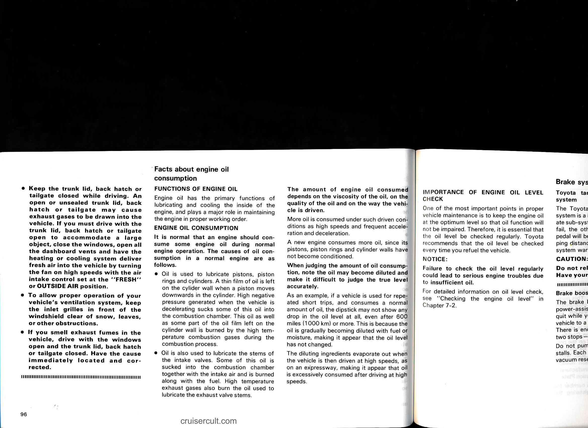

---

## Page 97

### The amount of engine oil consumed

The amount of engine oil consumed depends on the viscosity of the oil, on the quality of the oil and on the way the vehicle is driven.

More oil is consumed under such driven conditions as high speeds and frequent acceleration and deceleration.

A new engine consumes more oil, since its pistons, piston rings and cylinder walls have not become conditioned.

When judging the amount of oil consumption, note the oil may become diluted and make it difficult to judge the true level accurately.

As an example, if a vehicle is used for repeated short trips, and consumes a normal amount of oil, the dipstick may not show any drop in the oil level at all, even after 600 miles (1000 km) or more. This is because the oil is gradually becoming diluted with fuel or moisture, making it appear that the oil level has not changed.

The diluting ingredients evaporate out when the vehicle is then driven at high speeds, as on an expressway, making it appear that oil is excessively consumed after driving at high speeds.

---

## IMPORTANCE OF ENGINE OIL LEVEL CHECK

One of the most important points in proper vehicle maintenance is to keep the engine oil at the optimum level so that oil function will not be impaired. Therefore, it is essential that the oil level be checked regularly. Toyota recommends that the oil level be checked every time you refuel the vehicle.

**NOTICE:**  
Failure to check the oil level regularly could lead to serious engine troubles due to insufficient oil.

For detailed information on oil level check, see "Checking the engine oil level" in Chapter 7-2.

---

## Brake system

### Toyota tandem master cylinder brake system

The Toyota tandem master cylinder brake system is a hydraulic system with two separate sub-systems. If either sub-system should fail, the other will still work. However, the pedal will be harder to press, and your stopping distance will be longer. Also, the brake system warning light may come on.

**CAUTION:**  
Do not rely on a single brake system. Have your brakes fixed immediately.

### Brake booster

The brake booster uses engine vacuum to power-assist the brakes. If the engine should quit while you are driving, you can bring the vehicle to a stop with normal pedal pressure. There is enough reserve vacuum for one or two stops — but no more!

Do not pump the brake pedal if the engine stalls. Each push on the pedal uses up your vacuum reserve.

**CAUTION:**  
Even if the power assist is completely lost, the brakes will still work. But you will have to push the pedal hard — much harder than normal. And your braking distance will be longer.

---

cruisercult.com

97

---

## Page 98

# Luggage stowage precautions

When stowing luggage or cargo in or on the vehicle, observe the following:

- Put luggage or cargo in the luggage compartment when at all possible. Be sure all items are secured in place.
- Be careful not to bring the vehicle out of level. Locating the weight as far forward as possible helps keep the balance.
- For better fuel economy, do not carry unneeded weight.

CAUTION:
- To prevent luggage or packages from sliding forward during braking, do not stack anything in the luggage compartment higher than the seatbacks.
- Never allow anyone to ride in the luggage compartment. It is not designed for passengers. They should ride in their seats with wearing their seat belts. Otherwise, they are much more likely to suffer serious bodily injury, in the event of sudden braking or a collision.

NOTICE:
Do not load the vehicle beyond the vehicle capacity weight given in Part 8.

---

# Your Toyota’s identification

![Vehicle Identification illustration]

**VEHICLE IDENTIFICATION NUMBER**

The vehicle identification number is the legal identifier for your vehicle. This number is on the left top of the instrument panel, and can be seen through the windshield from outside.

The vehicle identification number is also on the manufacturer’s plate and the Certification Regulation Plate. Depending on the production date, your vehicle may be installed with a Certification Regulation Label, which also has the vehicle identification number and takes the place of the manufacturer’s plate and the Certification Regulation Plate.

This is the primary identification number for your Toyota. It is used in registering the ownership of your vehicle.

![Manufacturer's Plate illustration]

**MANUFACTURER’S PLATE**

![Certification Regulation Plate/Label illustration]

**CERTIFICATION REGULATION PLATE/LABEL**

![Engine illustration]

The engine number is stamped on the engine block as shown.

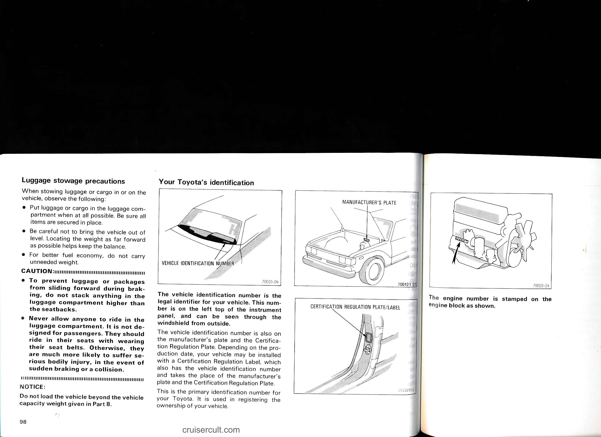

---

## Page 99

# MANUFACTURER'S PLATE

# CERTIFICATION REGULATION PLATE/LABEL

The engine number is stamped on the engine block as shown.

cruisercult.com

99

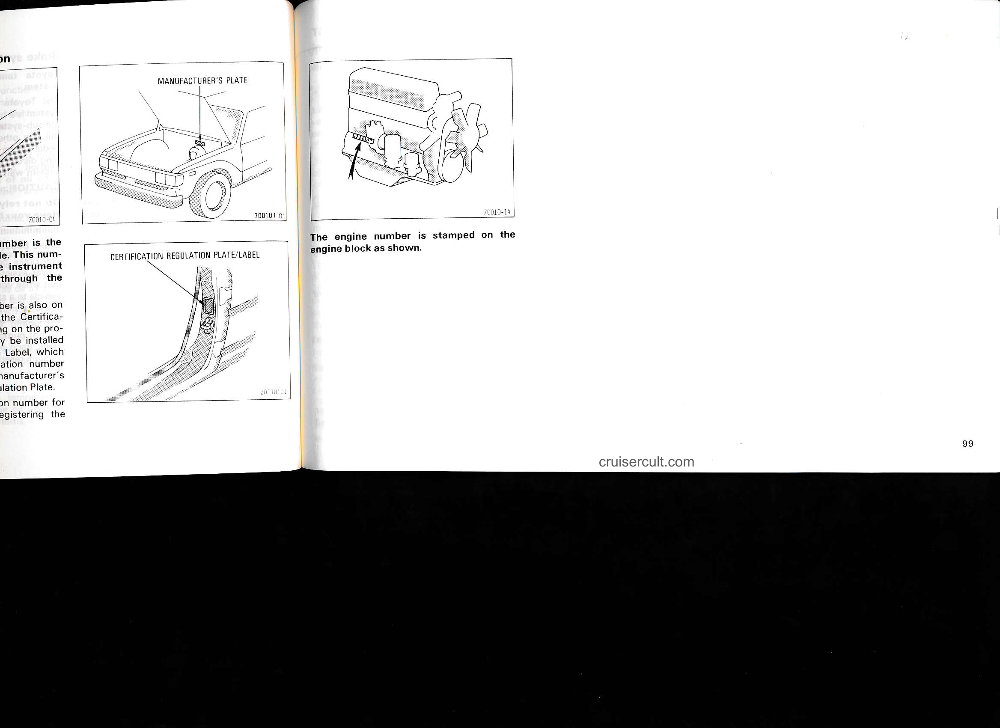

---

## Page 100

100

cruisercult.com

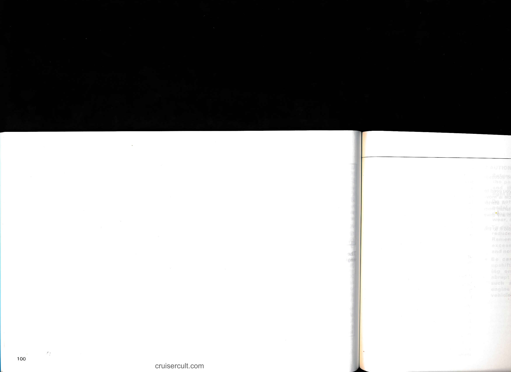

---

