# Part 3: Starting and Driving

## Page 101

# Part 3 STARTING AND DRIVING

- Before starting the engine
- How to start the engine
- Tips for driving in various conditions
- Off-road driving precautions
- Winter driving tips
- Trailer towing
- How to save fuel and make your vehicle last longer, too

cruisercult.com

101

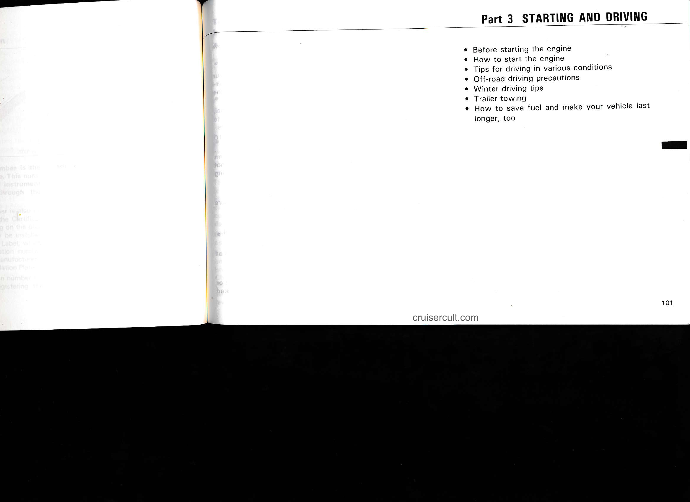

---

## Page 102

# Before starting the engine

1. Check the area around the vehicle before entering it.  
2. Adjust seat position, seatback angle, headrest height and steering wheel angle.  
3. Adjust inside and outside rear view mirrors.  
4. Lock all doors.  
5. Fasten seat belts.

Remember to check that the warning lights function when turning the key to "ON", and check the fuel gauge to see that you have sufficient fuel.

---

# How to start the engine

## (a) Before cranking

1. Apply the parking brake firmly.  
2. Turn off unnecessary lights and accessories.  
3. Put the selector lever in "P". If you need to restart the engine while the vehicle is moving, put the selector lever in "N". A starter safety device will prevent the starter from operating if the selector lever is in any drive position.  
4. Depress the brake pedal and hold it to the floor until driving off.

## (b) Starting the engine

Before starting the engine, be sure to follow the instructions in "(a) Before cranking".

### Normal starting procedure

The electronic fuel injection system in your engine automatically controls the proper air-fuel mixture for starting. So you can start the cold or hot engine as follows:

1. With your foot off the accelerator pedal, crank the engine by turning the key to "START". Release it when the engine starts.  
2. After the engine warms up for about 10 seconds, you are ready to drive.

If the weather is below freezing, let it warm up for a few minutes before driving. Do not leave the vehicle while the engine is warming up.

If the engine stalls...  
Simply restart it, using the correct procedure given in normal starting.

If the engine will not start—  
See "If your vehicle will not start" in Part 4.

**NOTICE:**  
Do not crank for more than 15 seconds at a time.  
Do not race a cold engine.  
If the engine becomes difficult to start or stalls frequently, have the engine checked immediately.

---

# Tips for driving in various conditions

- Always slow down in gusty crosswinds. This will allow you much better control.  
- If you have a flat tire while driving, do not brake suddenly. Keep a straight line while reducing speed. Then slowly move completely off the road to a safe place.  
- When parking on a hill, turn the front wheels until they touch the curb so that the vehicle will not roll. Apply the parking brake, and place the transmission in "P". If necessary, block the wheels.  
- Washing your vehicle or driving through deep water may get the brakes wet. To see whether they are wet, check for no traffic near you, and then press the pedal lightly. If you do not feel a normal braking force, the brakes are probably wet. To dry them, drive the vehicle cautiously while lightly pressing the brake pedal. If they still do not work safely, pull to the side of the road and call a Toyota dealer for assistance.  
- Toyota recommends not using four-wheel drive on dry hard-surfaced roads, because four-wheel driving will cause unnecessary noise and wear, and poor fuel economy.

---

102  
cruisercult.com

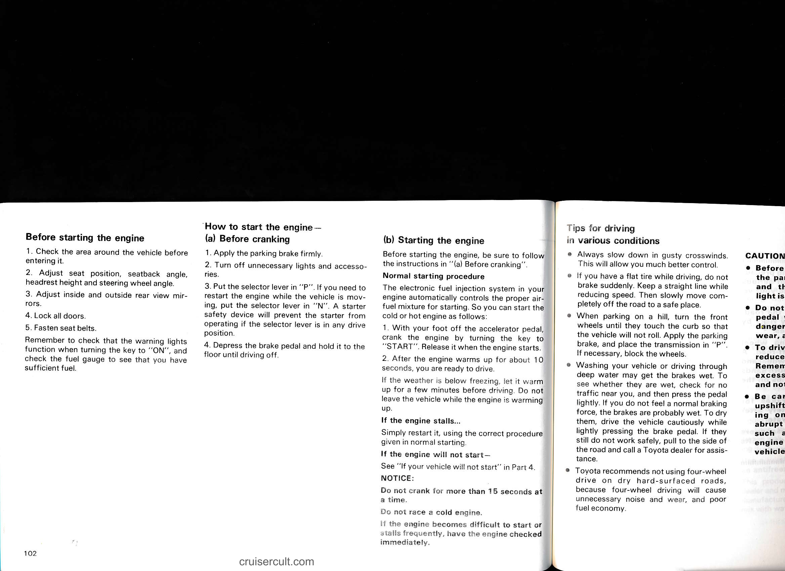

---

## Page 103

# (b) Starting the engine

Before starting the engine, be sure to follow the instructions in "(a) Before cranking".

## Normal starting procedure

The electronic fuel injection system in your engine automatically controls the proper air-fuel mixture for starting. So you can start the cold or hot engine as follows:

1. With your foot off the accelerator pedal, crank the engine by turning the key to "START". Release it when the engine starts.  
2. After the engine warms up for about 10 seconds, you are ready to drive.

If the weather is below freezing, let it warm up for a few minutes before driving. Do not leave the vehicle while the engine is warming up.

### If the engine stalls...

Simply restart it, using the correct procedure given in normal starting.

### If the engine will not start—

See "If your vehicle will not start" in Part 4.

**NOTICE:**

- Do not crank for more than 15 seconds at a time.  
- Do not race a cold engine.  
- If the engine becomes difficult to start or stalls frequently, have the engine checked immediately.

---

# Tips for driving in various conditions

- Always slow down in gusty crosswinds. This will allow you much better control.

- If you have a flat tire while driving, do not brake suddenly. Keep a straight line while reducing speed. Then slowly move completely off the road to a safe place.

- When parking on a hill, turn the front wheels until they touch the curb so that the vehicle will not roll. Apply the parking brake, and place the transmission in "P". If necessary, block the wheels.

- Washing your vehicle or driving through deep water may get the brakes wet. To see whether they are wet, check for no traffic near you, and then press the pedal lightly. If you do not feel a normal braking force, the brakes are probably wet. To dry them, drive the vehicle cautiously while lightly pressing the brake pedal. If they still do not work safely, pull to the side of the road and call a Toyota dealer for assistance.

- Toyota recommends not using four-wheel drive on dry hard-surfaced roads, because four-wheel driving will cause unnecessary noise and wear, and poor fuel economy.

---

# CAUTION:

- Before driving off, make sure that the parking brake is fully released and the parking brake reminder light is off.

- Do not rest your foot on the brake pedal while driving. It can cause dangerous overheating, needless wear, and poor fuel economy.

- To drive down a long or steep hill, reduce your speed and downshift. Remember, if you ride the brakes excessively, they may overheat and not work properly.

- Be careful when accelerating, upshifting, downshifting or braking on a slippery surface. The abrupt change in engine speed, such as sudden acceleration or engine braking, could cause the vehicle to spin or skid.

- Do not drive over 85 mph (140 km/h) unless your vehicle has high-speed capability tires, regardless of the legal speed limit. Driving over 85 mph (140 km/h) may result in tire failure, loss of control and possible injury. Be sure to consult a tire dealer to determine whether the tires on your vehicle are high-speed capability tires or not before driving at such speeds.

- Do not continue normal driving when the brakes are wet. If they are wet, your vehicle will require a longer stopping distance, and it may pull to one side when the brakes are applied.

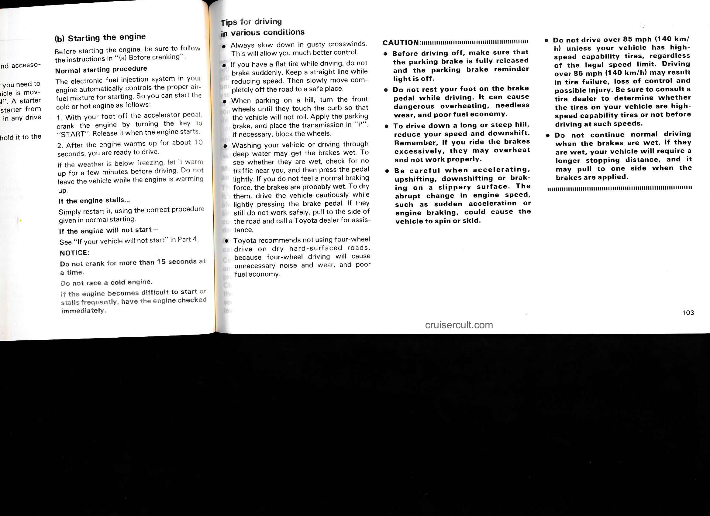

---

## Page 104

# Off-road driving precautions

When driving your vehicle off-road, please observe the following precautions to ensure your driving enjoyment and to help prevent the closure of areas to off-road vehicles.

a. Drive your vehicle only in areas where off-road vehicles are permitted to travel.

b. Respect private property. Get owner's permission before entering private property.

c. Do not enter areas that are closed. Honor gates, barriers and signs that restrict travel.

d. Stay on established roads. When conditions are wet, driving techniques should be changed or travel delayed to prevent damage to roads.

For owners in U.S. mainland, Hawaii and Puerto Rico:

To obtain additional information pertaining to driving your vehicle off-road, consult the following organizations.

- State and Local Parks and Recreation Departments
- State Motor Vehicle Bureau
- Recreational Vehicle Clubs
- U.S. Forest Service and Bureau of Land Management

---

**CAUTION:**

Always observe the following precautions to minimize the risk of serious personal injury or damage to your vehicle:

- Drive carefully when off the road. Do not take unnecessary risks by driving in dangerous places.
- Do not grip the steering wheel spokes when driving off-road. A bad bump could jerk the wheel and injure your hands. Keep both hands and especially your thumbs on the outside of the rim.
- Always check your brakes for effectiveness immediately after driving in sand, mud, or water.
- The driver and all passengers should fasten their seat belts whenever the vehicle is moving.

---

**NOTICE:**

If driving through water, such as when crossing shallow streams, first check the depth of the water and the bottom of the river bed for firmness. Drive slowly and avoid deep water. Take all necessary safety measures to ensure that damage to the engine or other components does not occur. Water entering the engine air intake will cause severe engine damage. Always perform a maintenance inspection after each day of off-road driving that has taken you through sand, mud, or water. (See Part 6.)

---

# Winter driving tips

Make sure you have ethylene-glycol coolant in the radiator.

This is the type of coolant your new Toyota is delivered with and the type your dealer will always use. In addition to preventing corrosion and lubricating the water pump, this coolant will prevent freezing and subsequent damage to the engine block.

Check the condition of the battery and cables.

Cold temperatures reduce the capacity of any battery, so it must be in top shape to provide enough power for winter starting. Chapter 7-3 tells you how to visually inspect the battery. Your Toyota dealer and most service stations will be pleased to check the level of charge.

---

104

cruisercult.com

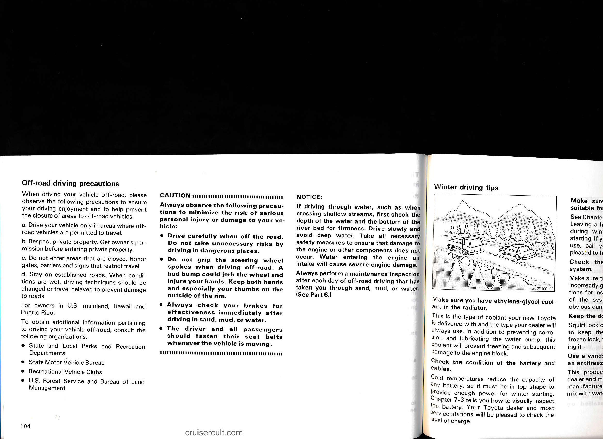

---

## Page 105

# Winter driving tips

---

**NOTICE:**

If driving through water, such as when crossing shallow streams, first check the depth of the water and the bottom of the river bed for firmness. Drive slowly and avoid deep water. Take all necessary safety measures to ensure that damage to the engine or other components does not occur. Water entering the engine air intake will cause severe engine damage.

Always perform a maintenance inspection after each day of off-road driving that has taken you through sand, mud, or water. (See Part 6.)

---

## Make sure you have ethylene-glycol coolant in the radiator.

This is the type of coolant your new Toyota is delivered with and the type your dealer will always use. In addition to preventing corrosion and lubricating the water pump, this coolant will prevent freezing and subsequent damage to the engine block.

## Check the condition of the battery and cables.

Cold temperatures reduce the capacity of any battery, so it must be in top shape to provide enough power for winter starting. Chapter 7-3 tells you how to visually inspect the battery. Your Toyota dealer and most service stations will be pleased to check the level of charge.

---

## Make sure the engine oil viscosity is suitable for the cold weather.

See Chapter 7-2 for recommended viscosity. Leaving a heavy summer oil in your vehicle during winter months may cause harder starting. If you are not sure about which oil to use, call your Toyota dealer—he will be pleased to help.

## Check the spark plugs and ignition system.

Make sure the plugs are not worn, fouled, or incorrectly gapped. (Chapter 7-2 has instructions for inspecting.) Visually check the rest of the system for loose connections or obvious damage.

## Keep the door locks from freezing.

Squirt lock de-icer or glycerine into the locks to keep them from freezing. To open a frozen lock, try heating the key before inserting it.

## Use a windshield washer fluid containing an antifreeze solution.

This product is available at your Toyota dealer and most auto parts stores. Follow the manufacturer's directions for how much to mix with water.

---

**NOTICE:**

Do not use engine antifreeze or any other substitute because it may damage your vehicle's paint.

Do not use your parking brake when there is a possibility it could freeze.

When parking, put the transmission into "P" and block the front wheels. Do not use the parking brake.

Keep ice and snow from accumulating under the fenders.

Ice and snow built up under your fenders can make steering difficult. During bad winter driving, stop and check under the fenders occasionally.

Depending on where you are driving, we recommend you carry some emergency equipment.

Some of the things you might put in the vehicle are tire chains, window scraper, bag of sand or salt, flares, small shovel, jumper cables, etc.

---

105

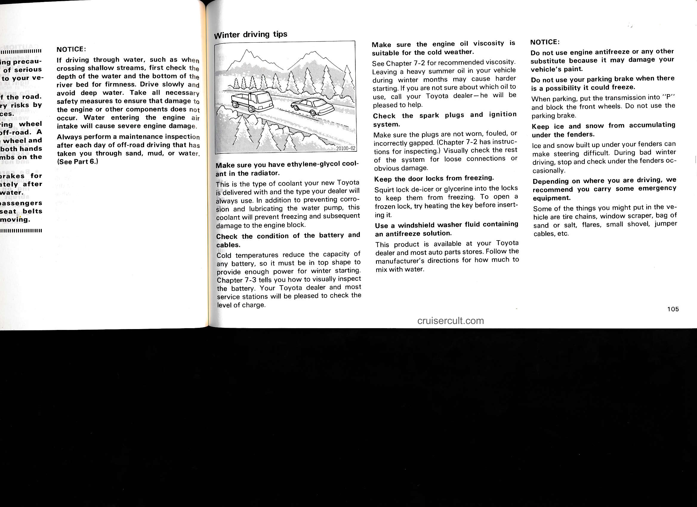

---

## Page 106

# Trailer towing

Your vehicle is designed primarily as a passenger-and-load-carrying vehicle. Towing a trailer will have an effect on handling, performance, braking, durability and driving economy (fuel consumption, etc.). Your safety and satisfaction depend on the proper use of correct equipment and cautious driving habits. For your safety and the safety of others, you must not overload your vehicle or trailer. Ask your local Toyota dealer for further details before towing.

## WEIGHT LIMITS

Before towing, make sure the total trailer weight, gross combination weight, gross vehicle weight, gross axle weight and trailer tongue load are all within the limits.

The total trailer weight and tongue load can be measured with platform scales found at a highway weighing station, building supply company, trucking company, junk yard, etc.

**CAUTION:**

- The total trailer weight (trailer weight plus its cargo load) must not exceed 3500 lb. (1587 kg). Exceeding this weight is dangerous. If towing a trailer over 2000 lb. (900 kg), it is necessary to use a sway control device with a sufficient capacity.

---

### CERTIFICATION REGULATION PLATE/LABEL

- The gross combination weight (sum of your vehicle weight plus its load and the total trailer weight) must not exceed 8000 lb. (3628 kg).

- The gross vehicle weight must not exceed the Gross Vehicle Weight Rating (GVWR) indicated on the Certification Regulation Plate/Label. The gross vehicle weight is the sum of weights of the unloaded vehicle, driver, passengers, luggage, hitch and trailer tongue load. It also includes the weight of any special equipment installed on your vehicle.

- The load on either the front or rear axle resulting from distribution of the gross vehicle weight on both axles must not exceed the Gross Axle Weight Rating (GAWR) listed on the Certification Regulation Plate/Label.

- The trailer cargo load should be distributed so that the tongue load is 9 to 11% of the total trailer weight, not exceeding the maximum of 350 lb. (158 kg). Never load the trailer with more weight in the back than in the front. About 60% of the trailer load should be in the front half of the trailer and the remaining 40% in the rear.

---

Diagram labels:
- TOTAL TRAILER WEIGHT
- TONGUE LOAD
- TONGUE LOAD / TOTAL TRAILER WEIGHT × 100 = 9 to 11 %
- 20110-03

---

106

cruisercult.com

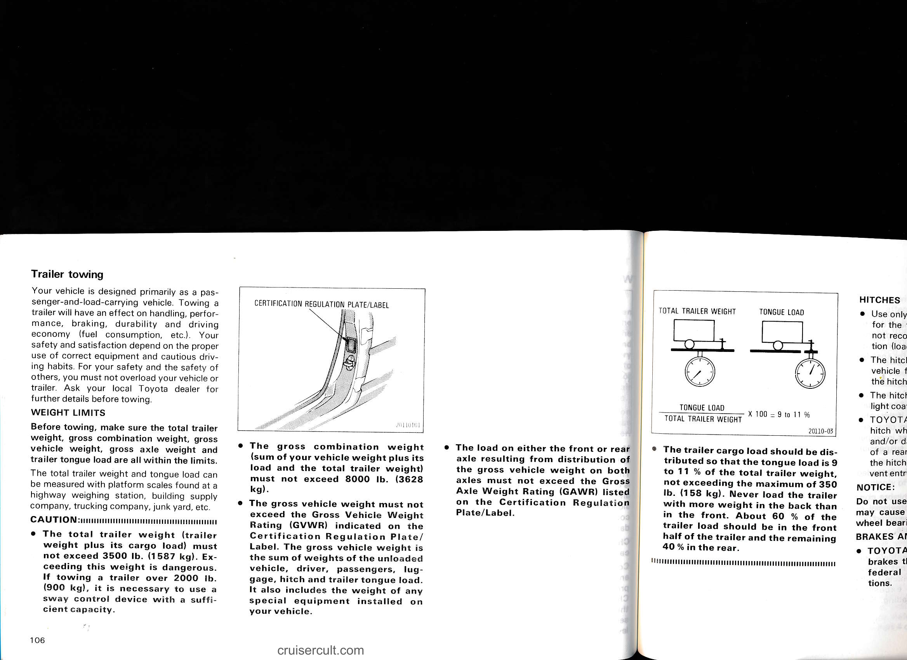

---

## Page 107

- The load on either the front or rear axle resulting from distribution of the gross vehicle weight on both axles must not exceed the Gross Axle Weight Rating (GAWR) listed on the Certification Regulation Plate/Label.

## TOTAL TRAILER WEIGHT / TONGUE LOAD
- TONGUE LOAD / TOTAL TRAILER WEIGHT x 100 = 9 to 11 %

- The trailer cargo load should be distributed so that the tongue load is 5 to 11 % of the total trailer weight, not exceeding the maximum of 350 lb. (158 kg). Never load the trailer with more weight in the back than in the front. About 60 % of the trailer load should be in the front half of the trailer and the remaining 40 % in the rear.

## HITCHES
- Use only a weight carrying hitch designed for the total trailer weight. Toyota does not recommend using a weight distribution (load equalizing) hitch.
- The hitch must be bolted securely to the vehicle frame and installed according to the hitch manufacturer's instructions.
- The hitch ball and king pin should have a light coat of grease.
- TOYOTA recommends removing the hitch when not towing to prevent injury and/or damage due to the hitch in event of a rear end collision. After removal of the hitch, seal the installation area to prevent entry of exhaust fumes and mud.

**NOTICE:**
- Do not use an axle-mounting hitch as it may cause damage to the axle housing, wheel bearings, wheels and/or tires.

## BRAKES AND SAFETY CHAINS
- TOYOTA recommends trailers with brakes that conform to any applicable federal and state/provincial regulations.

## CAUTION:
- If the total trailer weight exceeds 1000 lb. (450 kg), trailer brakes are required.
- Never tap into your vehicle's hydraulic system as it would lower its braking effectiveness.
- If damage occurs to the coupling unit or hitch ball, there is danger of the trailer wandering over into another lane. Therefore, a safety chain must always be used between the towing vehicle and the trailer. Leave sufficient slack in the chain for turns. The chain should cross under the trailer tongue to prevent the tongue from dropping to the ground in case it becomes damaged or separated. For correct safety chain procedures, follow the hitch or trailer manufacturer's recommendations.

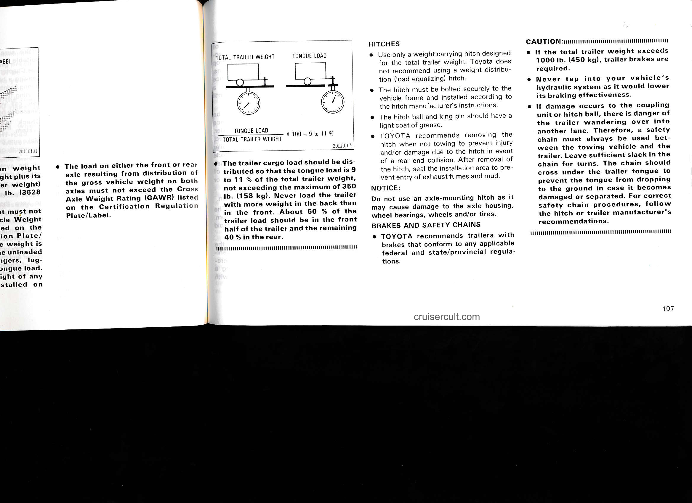

---

## Page 108

# TIRES
- Ensure that your vehicle's tires are properly inflated. Adjust tire pressure to the recommended cold tire pressure indicated below:

  Tire pressure, psi (kg/cm², kPa)  
  Front 26 (1.8, 180)  
  Rear 41 (2.8, 280)

- The trailer tires should be inflated to the pressure recommended by the trailer manufacturer in respect to the total trailer weight.

# TRAILER LIGHTS
- Trailer lights must comply with federal, state/provincial and local regulations. See your local recreational vehicle dealer or rental agency for the correct type of wiring and relays for your trailer. Check for correct operation of the turn signals and stop lights each time you hitch up. Direct splicing may damage your vehicle's electrical system and cause a malfunction of your lights.

# BREAK-IN SCHEDULE
- TOYOTA recommends that you do not tow a trailer with a new vehicle or a vehicle with any new power train component (engine, transmission, differential, wheel bearing, etc.) for the first 500 miles (800 km) of driving.

# MAINTENANCE
- If you tow a trailer, your vehicle will require more frequent maintenance due to the additional load. Refer to the maintenance schedule under severe driving conditions (schedule A) in Part 6 for specific information.

# PRE-TOWING SAFETY CHECK
- Check that your vehicle maintains a level position when a loaded and unloaded trailer is hitched. Do not drive if the vehicle has an abnormal nose-up or nose-down condition, and check for improper tongue load, overload, worn suspension or other possible causes.
- Be sure the trailer cargo is securely loaded so that it may not shift.
- Check that your rear view mirrors conform to any federal, state/provincial or local regulation. If not, install required rear view mirrors for towing purpose.

# TRAILER TOWING TIPS
When towing a trailer, your vehicle will handle differently than when not towing. The three main causes of vehicle-trailer accidents are driver error, excessive speed and improper trailer loading. Keep these in mind when towing:

- Before starting out, check operation of the lights and all vehicle-trailer connections. After driving a short distance, stop and recheck the lights and connections. Before actually towing a trailer, practice turning, stopping and backing with a trailer in an area away from traffic until you learn the feel.
- Because stopping distance may be increased, vehicle-to-vehicle distance should be increased when towing a trailer. For each 10 mph (16 km/h) of speed, allow at least one vehicle and trailer length between you and the vehicle ahead. Avoid sudden braking as you may skid, resulting in jackknifing and loss of control. This is especially true on wet or slippery surfaces.
- Avoid jerky starts or sudden acceleration.
- Avoid jerky steering and sharp turns. The trailer could hit your vehicle in a tight turn. Slow down before making a turn to avoid the necessity of sudden braking.
- Remember that when making a turn, the trailer wheels will be closer than the vehicle wheels to the inside of the turn. Therefore, compensate for this by making a larger than normal turning radius with your vehicle.
- Backing with a trailer is difficult and requires practice. Grip the bottom of the steering wheel and move your hand to the left to move the trailer to the left. Move your hand to the right to move the trailer to the right. (This procedure is generally opposite to that when backing without a trailer). Also, just turn the steering wheel a little at a time, avoiding sharp or prolonged turning. Have someone guide you when backing to reduce the risk of an accident.

108

cruisercult.com

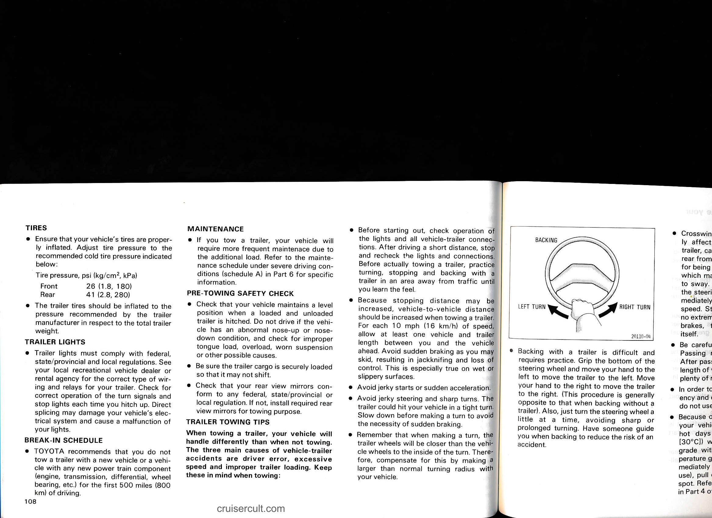

---

## Page 109

- Before starting out, check operation of the lights and all vehicle-trailer connections. After driving a short distance, stop and recheck the lights and connections. Before actually towing a trailer, practice turning, stopping and backing with a trailer in an area away from traffic until you learn the feel.

- Because stopping distance may be increased, vehicle-to-vehicle distance should be increased when towing a trailer. For each 10 mph (16 km/h) of speed, allow at least one vehicle and trailer length between you and the vehicle ahead. Avoid sudden braking as you may skid, resulting in jackknifing and loss of control. This is especially true on wet or slippery surfaces.

- Avoid jerky starts or sudden acceleration.

- Avoid jerky steering and sharp turns. The trailer could hit your vehicle in a tight turn. Slow down before making a turn to avoid the necessity of sudden braking.

- Remember that when making a turn, the trailer wheels will be closer than the vehicle wheels to the inside of the turn. Therefore, compensate for this by making a larger than normal turning radius with your vehicle.

BACKING

[Diagram: Steering wheel with arrows labeled LEFT TURN (arrow left) and RIGHT TURN (arrow right) — BACKING]

- Backing with a trailer is difficult and requires practice. Grip the bottom of the steering wheel and move your hand to the left to move the trailer to the left. Move your hand to the right to move the trailer to the right. (This procedure is generally opposite to that when backing without a trailer). Also, just turn the steering wheel a little at a time, avoiding sharp or prolonged turning. Have someone guide you when backing to reduce the risk of an accident.

- Crosswinds and rough roads will adversely affect handling of your vehicle and trailer, causing sway. Pay attention to the rear from time to time to prepare yourself for being passed by large trucks or buses, which may cause your vehicle and trailer to sway. If swaying happens, firmly grip the steering wheel and reduce speed immediately but gradually. Never increase speed. Steer straight ahead. If you make no extreme correction with the steering or brakes, the combination will stabilize itself.

- Be careful when passing other vehicles. Passing requires considerable distance. After passing a vehicle, do not forget the length of your trailer and be sure you have plenty of room before changing lanes.

- In order to maintain engine braking efficiency and electrical charging performance, do not use the "D" range.

- Because of the added load of the trailer, your vehicle's engine may overheat on hot days (at temperatures over 85°F [30°C]) when going up a long or steep grade with a trailer. If the engine temperature gauge indicates overheating, immediately turn off the air conditioner (if in use), pull off the road and stop in a safe spot. Refer to "If your vehicle overheats" in Part 4 of this manual.

- Always place wheel blocks under both the vehicle and trailer wheels when parking. Apply the parking brake firmly. Put the transmission in "P". Avoid parking on a slope with a trailer, but if it cannot be avoided, do so only after performing the following:

  1. Apply the brakes and hold.  
  2. Have someone place wheel blocks under both the vehicle and trailer wheels.  
  3. When the wheel blocks are in place, release your brakes slowly until the blocks absorb the load.  
  4. Apply the parking brake firmly.  
  5. Shift into "P" and turn off the engine.

- When restarting out after parking on a slope:

  1. With the transmission in "P" range, start the engine. Be sure to keep the brake pedal depressed.  
  2. Shift into the "3", "2", "L" or "R" range.  
  3. Release the parking brake and brake pedal and slowly pull or back away from the wheel blocks. Stop and apply your brakes.  
  4. Have someone retrieve the blocks.

cruisercult.com

109

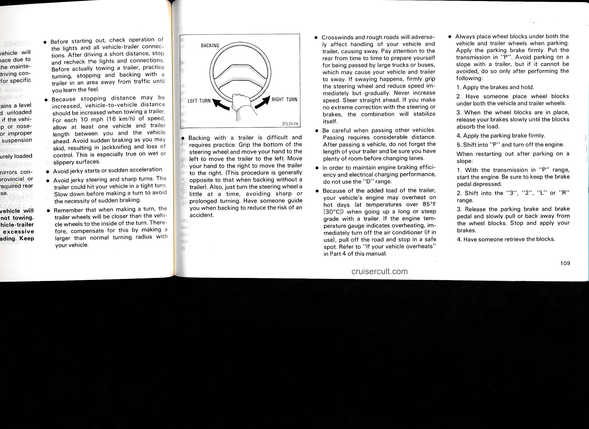

---

## Page 110

# CAUTION:

- Do not exceed 45 mph (72 km/h) or the posted towing speed limit, whichever is lower. Because instability (swaying) of a towing vehicle-trailer combination usually increases as the speed increases, exceeding 45 mph (72 km/h) may cause loss of control.

- Slow down and downshift before descending steep or long downhill grades. Do not make sudden downshifts.

- Avoid holding the brake pedal down too long or too frequently. This could cause the brakes to overheat and result in reduced braking efficiency.

---

# How to save fuel and make your vehicle last longer, too

Getting more mileage/kilometers from a gallon/liter of fuel is easy—just take it easy. It will help make your vehicle last longer, too. Here are some specific tips on how to save money on both fuel and repairs:

- Keep your tires inflated at the correct pressure. Check the pressure at least once a month. Underinflation causes tire wear and wastes fuel.

- Do not carry unneeded weight in your vehicle. Excess weight puts a heavier load on the engine, causing greater fuel consumption.

- Avoid lengthy warm-up idling. Once the engine is running smoothly, begin driving—but gently. Remember, however, that in cold winter days this may take a little longer.

- Accelerate slowly and smoothly. Avoid jackrabbit starts.

- Avoid long engine idling. If you have a long wait and you are not in traffic, it is better to turn off the engine and start again later.

- Avoid engine overrevving. Use a gear range suitable for the road you are travelling on.

- Use your air conditioner only when absolutely necessary. The air conditioner puts an extra load on the engine.

- Avoid continuous speeding up and slowing down. Stop-and-go driving wastes fuel.

- Avoid unnecessary stopping and braking. Maintain a steady pace. Try to time the traffic signals so you only need to stop as little as possible or take advantage of through streets to avoid traffic lights. Keep a proper distance from other vehicles to avoid sudden braking. This will also reduce wear on your brakes.

- Avoid heavy traffic or traffic jams whenever possible.

- Do not rest your foot on the brake pedal. This causes needless wear, overheating and poor fuel economy.

- Maintain a moderate speed on highways. The faster you drive, the greater the fuel consumption. By reducing your speed, you will cut down on fuel consumption.

- Keep the front wheels in proper alignment. Avoid hitting the curb and slow down on rough roads. Improper alignment not only causes faster tire wear but also puts an extra load on the engine, which, in turn, wastes fuel.

- Keep the bottom of your vehicle free from mud, etc. This not only lessens weight but also helps prevent corrosion.

- Keep your vehicle tuned-up and in top shape. A dirty air cleaner, improper valve clearance, dirty plugs, dirty oil and grease, brakes not adjusted, etc. all lower engine performance and contribute to poor fuel economy. For longer life of all parts and lower operating costs, keep all maintenance work on schedule, and if you often drive under severe conditions, see that your vehicle receives more frequent maintenance (See Part 6).

---

# CAUTION:

Never turn off the engine to coast down hills. Your power steering and brake booster will not function without the engine running. Also, the emission control system operates properly only when the engine is running.

---

110

cruisercult.com

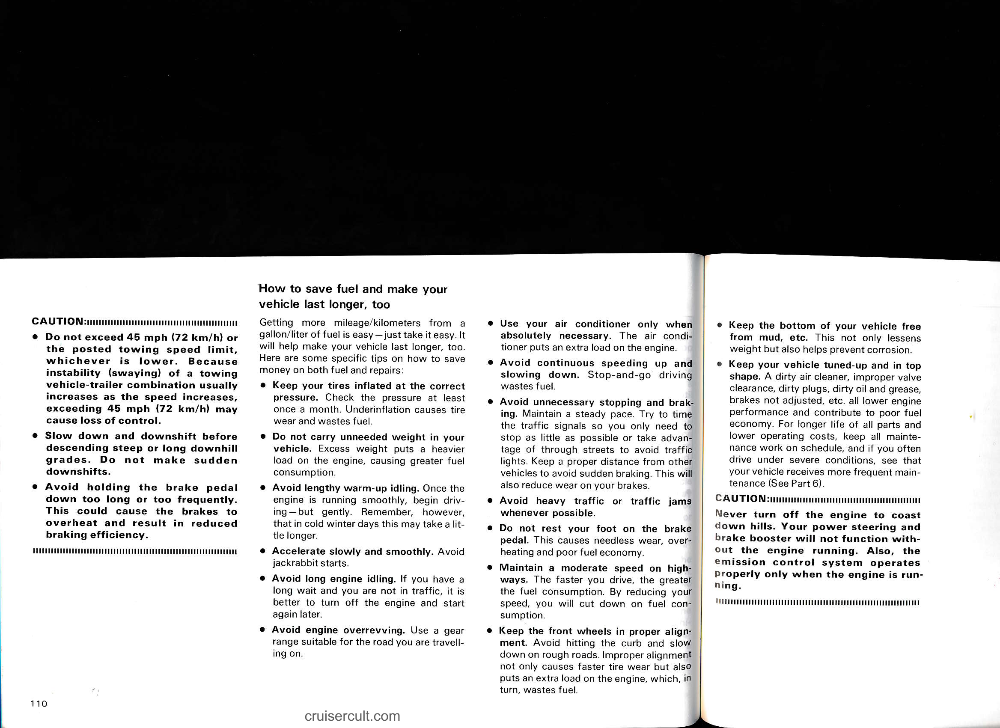

---

## Page 111

- Use your air conditioner only when absolutely necessary. The air conditioner puts an extra load on the engine.
- Avoid continuous speeding up and slowing down. Stop-and-go driving wastes fuel.
- Avoid unnecessary stopping and braking. Maintain a steady pace. Try to time the traffic signals so you only need to stop as little as possible or take advantage of through streets to avoid traffic lights. Keep a proper distance from other vehicles to avoid sudden braking. This will also reduce wear on your brakes.
- Avoid heavy traffic or traffic jams whenever possible.
- Do not rest your foot on the brake pedal. This causes needless wear, overheating and poor fuel economy.
- Maintain a moderate speed on highways. The faster you drive, the greater the fuel consumption. By reducing your speed, you will cut down on fuel consumption.
- Keep the front wheels in proper alignment. Avoid hitting the curb and slow down on rough roads. Improper alignment not only causes faster tire wear but also puts an extra load on the engine, which, in turn, wastes fuel.
- Keep the bottom of your vehicle free from mud, etc. This not only lessens weight but also helps prevent corrosion.
- Keep your vehicle tuned-up and in top shape. A dirty air cleaner, improper valve clearance, dirty plugs, dirty oil and grease, brakes not adjusted, etc. all lower engine performance and contribute to poor fuel economy. For longer life of all parts and lower operating costs, keep all maintenance work on schedule, and if you often drive under severe conditions, see that your vehicle receives more frequent maintenance (See Part 6).

**CAUTION:**

Never turn off the engine to coast down hills. Your power steering and brake booster will not function without the engine running. Also, the emission control system operates properly only when the engine is running.

cruisercult.com

111

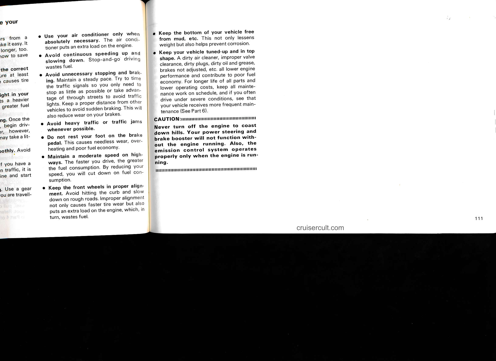

---

## Page 112

- 112
- cruisercult.com

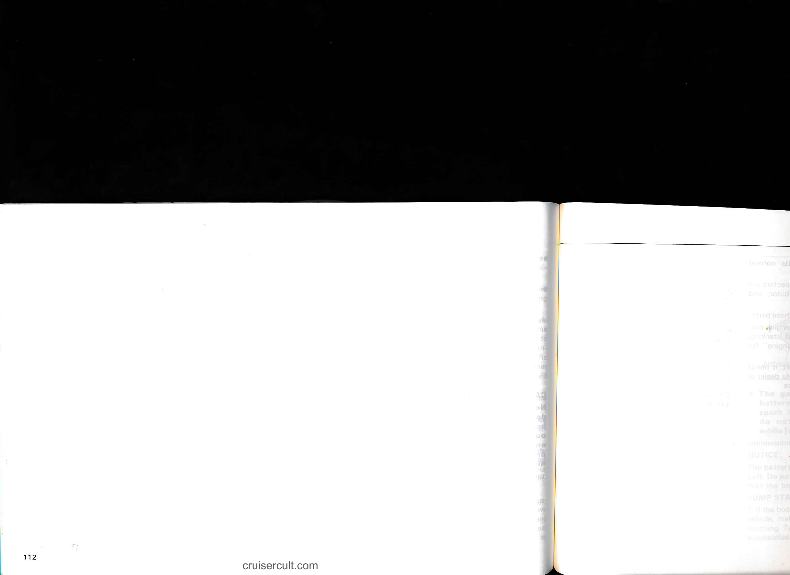

---

