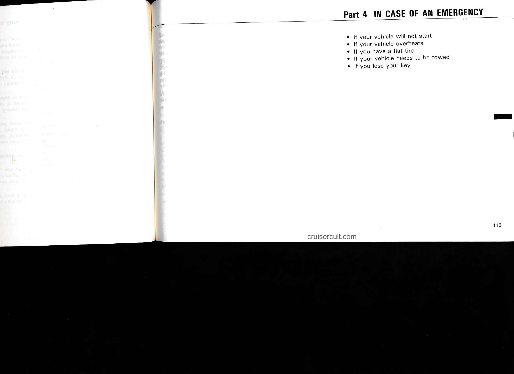
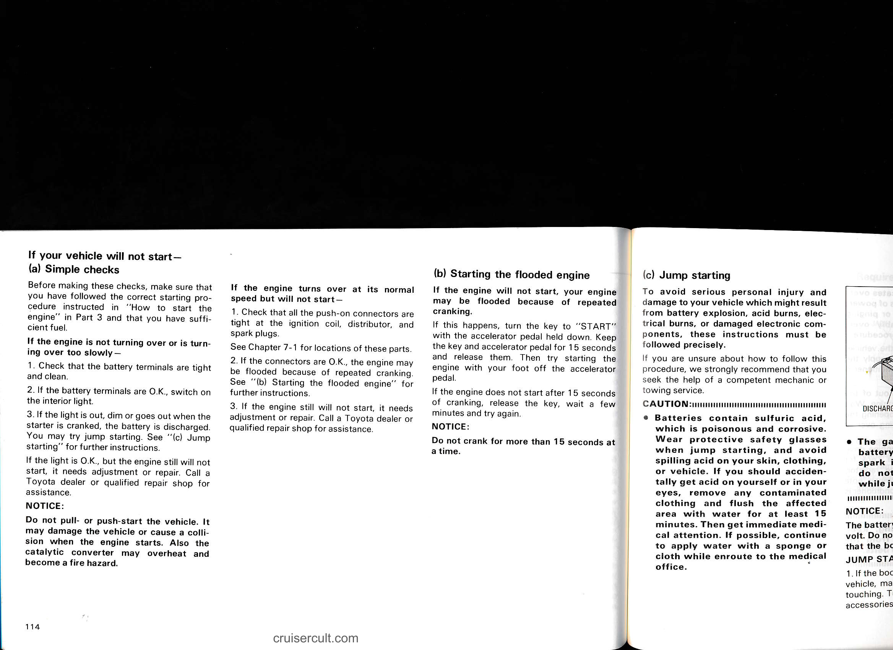

# Part 4: In Case of an Emergency

## Page 113

*Page content not yet processed*

---

## Page 114

*Page content not yet processed*

---

## Page 115

*Page content not yet processed*

---

## Page 116

*Page content not yet processed*

---

## Page 117

*Page content not yet processed*

---

## Page 118

*Page content not yet processed*

---

## Page 119

*Page content not yet processed*

---

## Page 120

*Page content not yet processed*

---

## Page 121

*Page content not yet processed*

---

## Page 122

*Page content not yet processed*

---

## Page 123

*Page content not yet processed*

---

## Page 124

*Page content not yet processed*

---

